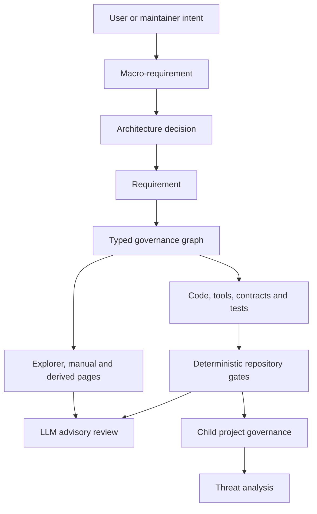
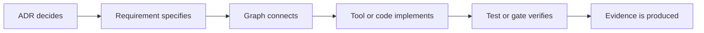
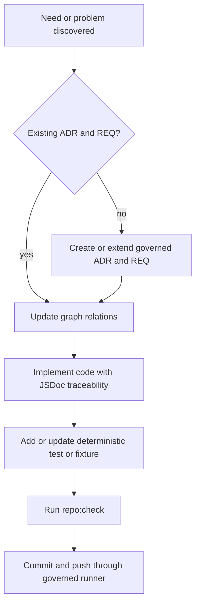
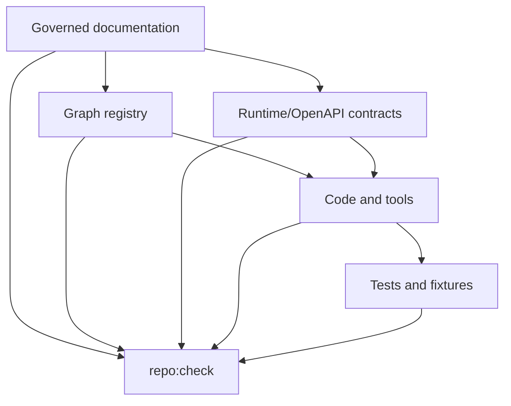
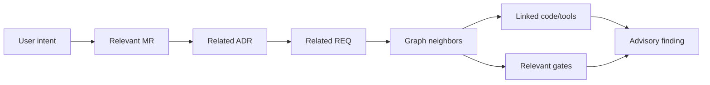

# Part 01 - Current-state foundations

## Purpose of this part

This first part explains the current knowledge-governance foundation of threat-forge. It is written as a study guide for a student or developer who needs to understand the project before adding new code, new documentation or new threat-analysis behavior.

The objective is not to replace ADRs, requirements or graph registries. The objective is to explain how those canonical sources work together and how the repository gates prevent documentation, graph, contracts and code from diverging.

## Baseline covered by this part

This manual slice starts from the state where `MR-0010` has been declared as a dedicated macro-requirement for the Project Knowledge Governance Manual.

At that point, the project has the following confirmed characteristics:

- 11 macro-requirements;
- 278 requirements;
- 87 ADR;
- 493 graph nodes;
- 1241 SPO relations;
- 376 governed Markdown body files;
- 388 Project Documentation Explorer snapshot items/details;
- 44 passing runtime tests.

These numbers are not the source of truth. They are a snapshot useful for study. The source of truth remains the repository content and the latest `repo:check` output.

## Why threat-forge starts from documentation governance

Threat-forge is not only an application UI or a set of scripts. Its first foundation is the ability to manage project knowledge in a way that is:

- explicit enough for humans to review;
- structured enough for deterministic tools to validate;
- connected enough for LLMs to retrieve context;
- stable enough to support future child-project governance;
- precise enough to become the basis for threat analysis.

The project therefore treats documentation as operational state. Decisions, requirements, graph relations, contracts, code and tests must remain aligned.

## High-level system map



The important point is the direction of authority. A developer should not start by writing arbitrary code. A developer should first understand the relevant MR, ADR and requirement, then update the graph and only then implement code or tooling.

## Canonical sources and derived outputs

Threat-forge separates canonical sources from generated or explanatory outputs.

| Kind | Examples | Role |
|---|---|---|
| Canonical governance source | MR registry, ADR registry, requirement registry, body Markdown, graph YAML | Defines project truth |
| Canonical implementation source | runtime contracts, OpenAPI, tools, tests, JSDoc traceability | Implements or verifies governed requirements |
| Derived output | HTML pages, Project Documentation Explorer snapshot, build artifacts | Helps navigation and review |
| Advisory output | LLM semantic review reports | Suggests issues but does not decide |
| Study output | this manual and its PDF rendering | Explains how to understand the project |

A derived output can be regenerated. A manual explanation can be corrected. A canonical source must be changed through the governed flow.

## The core governance chain

The canonical development chain is:



The project currently uses this pattern across documentation, code traceability, repository operation governance, child-project planning and semantic hardening gates.

## Graph relation model

The graph is not only a visualization. It is an index of typed semantic relations. The most important relation families are:

| Relation | Meaning |
|---|---|
| `has_decision` | a macro-requirement owns an ADR |
| `justifies` | an ADR canonically justifies a requirement |
| `belongs_to` | an entity belongs to a macro-requirement |
| `implements` | a requirement implements a macro-requirement |
| `implemented_by` | a requirement is implemented by a tool, component or artifact |
| `verifies` | a verification artifact verifies a requirement |
| `described_by` | an entity is explained by a document |

This allows a human or LLM to ask traceability questions such as:

- Which ADR justifies this requirement?
- Which tool implements this requirement?
- Which gate verifies this requirement?
- Which document explains this concept?
- Which macro-requirement owns this decision?

## Why graph consistency now matters

The repository now includes a deterministic graph and registry ownership gate. That gate checks that registered decisions and requirements are coherent with graph relations. In particular, it checks the core ownership path:

```text
MR has_decision ADR
ADR justifies REQ
REQ belongs_to MR
REQ derived_from_decision_id == ADR
```

This prevents a dangerous class of divergence: a requirement appearing in a registry as if it belongs to one decision while the graph suggests another ownership path.

## Code coherence and anti-duplication

Code in threat-forge must not evolve as a separate undocumented system. A new tool, runtime contract, API or test should have a clear reason in the project model.

A correct change usually follows this path:



This prevents two common problems:

1. duplicate code that solves a problem already governed elsewhere;
2. undocumented code that future developers and LLMs cannot correctly place in the project model.

## Active gate taxonomy

Threat-forge currently has several classes of gates.

| Gate class | Purpose | Examples |
|---|---|---|
| Format gates | Ensure files are parseable and structurally valid | graph format, body format |
| Registry gates | Ensure required fields and controlled fields are present | ADR fields, requirement fields |
| Append-first gates | Protect historical records from silent rewrite | append-first protected records |
| Traceability gates | Ensure code and graph trace implementation links | code traceability |
| Semantic deterministic gates | Check meaning that can be deterministically verified | vocabulary consistency, graph ownership consistency |
| Contract gates | Keep API/runtime contracts coherent | OpenAPI contract check |
| Build/test gates | Keep executable slices working | frontend build, runtime tests |
| Child-project gates | Validate child governance profiles and plans | child governance registry, gate planner |
| Advisory LLM review | Find semantic risks without blocking | prompt-governed LLM review |

The distinction between deterministic and advisory checks is important. Repository validity must be decided by deterministic gates. LLMs may help discover issues, but they do not become automatic sources of truth.

## How documentation and code divergence is controlled

Divergence is controlled by multiple overlapping mechanisms rather than by one large validator.



Examples:

- if an ADR and a requirement disagree about ownership, the ownership consistency gate can fail;
- if runtime and OpenAPI expose different governed status values, the controlled vocabulary gate can fail;
- if a governed body exists without a registry reference, the orphan body gate can fail;
- if historical protected records are rewritten without confirmation, the append-first gate can fail;
- if code artifacts lack required traceability, the code traceability gate can fail.

## The role of the Project Documentation Explorer

The Project Documentation Explorer is a derived navigation surface. It helps humans inspect macro-requirements, ADRs, requirements, graph-derived states and governed body content. It is useful for study, but it is not the canonical source itself.

The Explorer should eventually help students and developers answer questions like:

- where is this requirement defined?
- which ADR justified it?
- which graph relations connect it?
- is there code linked to it?
- which gate would fail if I changed it incorrectly?

## The role of MR-0010

`MR-0010` exists because the manual is not a minor document. It is a dedicated capability: it turns project governance into a studyable, teachable and LLM-readable system.

Its initial requirements cover:

- the governed manual structure;
- learning paths for students and developers;
- a diagram strategy;
- code-coherence and anti-duplication guidance;
- LLM reading routes;
- the boundary between canonical sources and thesis-oriented explanation.

## LLM-assisted development boundary

LLM assistance is useful because the project contains many connected records. A human can read them manually, but an LLM can help gather context, detect possible overlap and propose a micropasso.

However, the LLM must respect this boundary:

```text
LLM may read, summarize, compare and propose.
LLM may not decide canonical truth.
LLM may not mutate the repository autonomously.
LLM may not bypass deterministic gates.
```

Every LLM finding should include evidence:

- file path;
- entity id;
- relation id when relevant;
- confidence;
- limitations;
- recommended next action.

## Reading route for a new developer

A new developer should study the project in this order:

1. Macro-requirements registry, to understand the project areas.
2. MR-0000, to understand repository governance and gates.
3. MR-0001, to understand documentation and traceability.
4. MR-0002, to understand reusable interfaces and Project Documentation Explorer architecture.
5. MR-0003, to understand child-project governance.
6. MR-0010, to understand how the manual organizes study and LLM reading routes.
7. The relevant ADR and requirements for the intended change.
8. The graph around those entities.
9. The implementation artifacts and tests linked by the graph.

## Reading route for a student

A student should focus first on concepts, then on implementation:

1. What is a macro-requirement?
2. What is an ADR?
3. What is a requirement?
4. Why does the graph exist?
5. What is the difference between a canonical source and a derived page?
6. How does `repo:check` work?
7. Why does code need traceability?
8. How can an LLM help without becoming the authority?
9. How will this foundation support child projects and threat analysis?

## Reading route for an LLM-assisted reviewer

An LLM-assisted reviewer should not start from free-text search alone. The preferred path is graph-guided:



The report must not invent authority. It must point back to repository evidence.

## Diagram conventions for future chapters

Manual diagrams should be:

- small enough to study;
- versionable as text;
- connected to MR/ADR/REQ where possible;
- focused on one question at a time;
- reusable in a future thesis;
- understandable without hidden UI state.

Large global graphs are useful for orientation, but local diagrams are better for learning. Future chapters should prefer local graph views around a single concept, gate, tool or workflow.

## What this part does not cover yet

This first part does not yet deeply explain:

- each individual gate implementation;
- detailed backend/frontend architecture;
- child-project executor design;
- Knowledge Graph ingestion;
- Base Analysis;
- STRIDE, PASTA or STRIDE-AI;
- thesis chapter structure.

Those are later manual parts. This first part establishes the study foundation.

## Study checklist

After reading this part, a student or developer should be able to answer:

- Why is documentation a governed project asset in threat-forge?
- What is the difference between canonical source and derived output?
- Why must an ADR justify a requirement?
- What role does the graph play beyond visualization?
- Why does code need JSDoc traceability?
- Which checks prevent code and documentation divergence?
- Why are LLM reviews advisory-only?
- How should a new change be planned before code is written?

## Next manual parts

The next useful parts are:

1. a detailed chapter on canonical sources and file layout;
2. a detailed chapter on graph relations and local graph reading;
3. a detailed gate catalog with failure examples;
4. a developer playbook for adding coherent code;
5. an LLM-assisted development workflow chapter;
6. a child-project governance study chapter;
7. a threat-analysis roadmap chapter.
