# Part 02 - Graph and traceability model

## Purpose of this part

This part explains how to study the threat-forge graph and how to use it to understand traceability between macro-requirements, decisions, requirements, documents, implementation artifacts, tools, contracts and verification artifacts.

The goal is practical. After reading this part, a student or developer should be able to answer questions such as:

- Which decision justified this requirement?
- Which macro-requirement owns this decision?
- Which documents explain this requirement?
- Which tools or source files implement it?
- Which gate or test verifies it?
- What should be read before changing related code?
- Where can duplication appear if a new requirement, tool or document is added without checking the existing graph?

The graph is not a decoration. It is the project knowledge index that allows humans and LLMs to navigate the repository without relying only on keyword search.

## What the graph is

In threat-forge, a graph is a governed YAML registry that lists typed nodes and typed SPO relations.

SPO means:

```text
subject predicate object
```

For example:

```text
MR-0010 has_decision ADR-0001
ADR-0001 justifies MR-0010REQ-0003
MR-0010REQ-0003 described_by DOC-MR0010-project-knowledge-governance-manual-part-02
```

The graph connects governance records to their explanations, implementations and verification evidence. It does not replace the registries or body Markdown files. It creates a typed navigation layer across them.

## Graph index and graph files

The graph index lists the graph registries that belong to the Project Model. Each graph normally belongs to one macro-requirement and captures the local knowledge neighborhood for that macro-requirement.

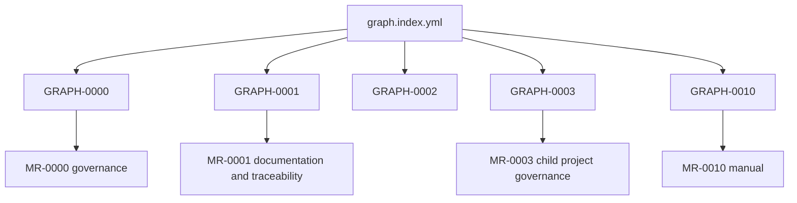

The important study habit is to start local. Do not begin from the whole graph unless you are doing global audit work. Start from the macro-requirement or entity involved in the change, then expand the local relations.

## The registry-body-graph triad

Threat-forge separates metadata, explanatory content and semantic relations.

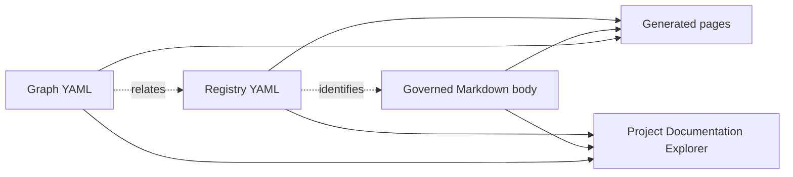

### Registry YAML

Registry files contain compact canonical metadata. For a requirement, the registry records fields such as the requirement id, title, status, acceptance state, macro-requirement ownership and decision origin.

A registry should answer: **what is this entity and how is it governed?**

### Governed Markdown body

The body file contains structured explanation. It should explain context, behavior, acceptance criteria, consequences and other content required by the body profile.

A body should answer: **what does this entity mean in detail?**

### Graph YAML

The graph file contains typed relationships. It shows ownership, justification, implementation and explanation links.

A graph should answer: **how does this entity connect to the rest of the system?**

### Derived pages and Explorer

Generated pages and Explorer snapshots read the canonical sources and produce navigation surfaces. They are useful for study and review, but they are not the canonical source.

## Core node families

The graph can contain different node families. A student does not need to memorize every node type at first, but should recognize the main groups.

| Node family | Examples | Study question |
|---|---|---|
| Governance entities | MacroRequirement, ADR, Requirement | What was decided and specified? |
| Documents | manual parts, reference pages, guides | Where is this explained? |
| Implementation artifacts | Tool, component, source artifact | What implements the requirement? |
| Verification artifacts | gate, test, fixture, generated evidence | What verifies the requirement? |
| Runtime/interface artifacts | OpenAPI, contracts, schemas | What boundary exposes the behavior? |

The graph becomes powerful when these families are connected. A requirement without a decision is weak. A tool without a requirement is hard to justify. A document without a graph relation is difficult for the LLM to prioritize.

## Core relation pattern

The most important current chain is:

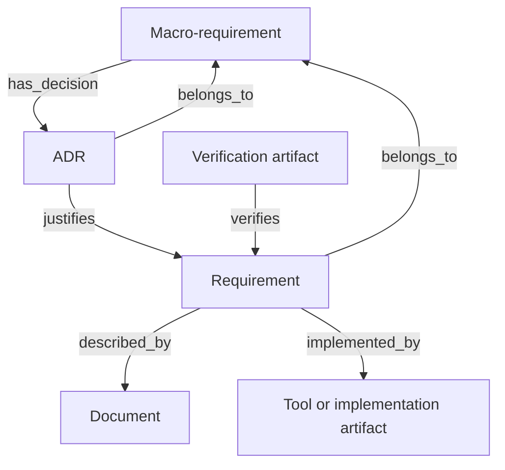

This chain tells a reviewer why an implementation exists and what should be checked if it changes.

## Relation semantics

### `has_decision`

`has_decision` links a macro-requirement to an ADR that belongs to it.

Use it to ask:

```text
Which decisions define this macro-requirement area?
```

### `belongs_to`

`belongs_to` identifies macro-requirement ownership for an entity.

Use it to ask:

```text
Which macro-requirement owns this ADR or requirement?
```

This is important because different macro-requirements may discuss nearby topics. Ownership prevents duplicate or ambiguous authority.

### `justifies`

`justifies` links an ADR to the requirement it canonically justifies.

Use it to ask:

```text
Which decision gave this requirement its authority?
```

The graph and registry ownership consistency gate checks this relation against requirement registry metadata such as `derived_from_decision_id`.

### `implements`

`implements` links a requirement to the macro-requirement it implements.

Use it to ask:

```text
Which macro-requirement is fulfilled by this requirement?
```

### `implemented_by`

`implemented_by` links a requirement to the code, tool, contract or implementation artifact that realizes it.

Use it to ask:

```text
Which code or tool implements this requirement?
```

A tool should not appear as an isolated script. It should be linked to the requirement it implements.

### `verifies`

`verifies` links a verification artifact to a requirement.

Use it to ask:

```text
Which gate or test proves this requirement is enforced?
```

### `described_by`

`described_by` links a governed entity to explanatory documentation.

Use it to ask:

```text
Where can I study this entity in detail?
```

The manual uses `described_by` relations so that study pages are discoverable from the graph without becoming canonical replacements for ADR or requirement records.

## Local graph reading procedure

When studying or changing the project, use this repeatable procedure.

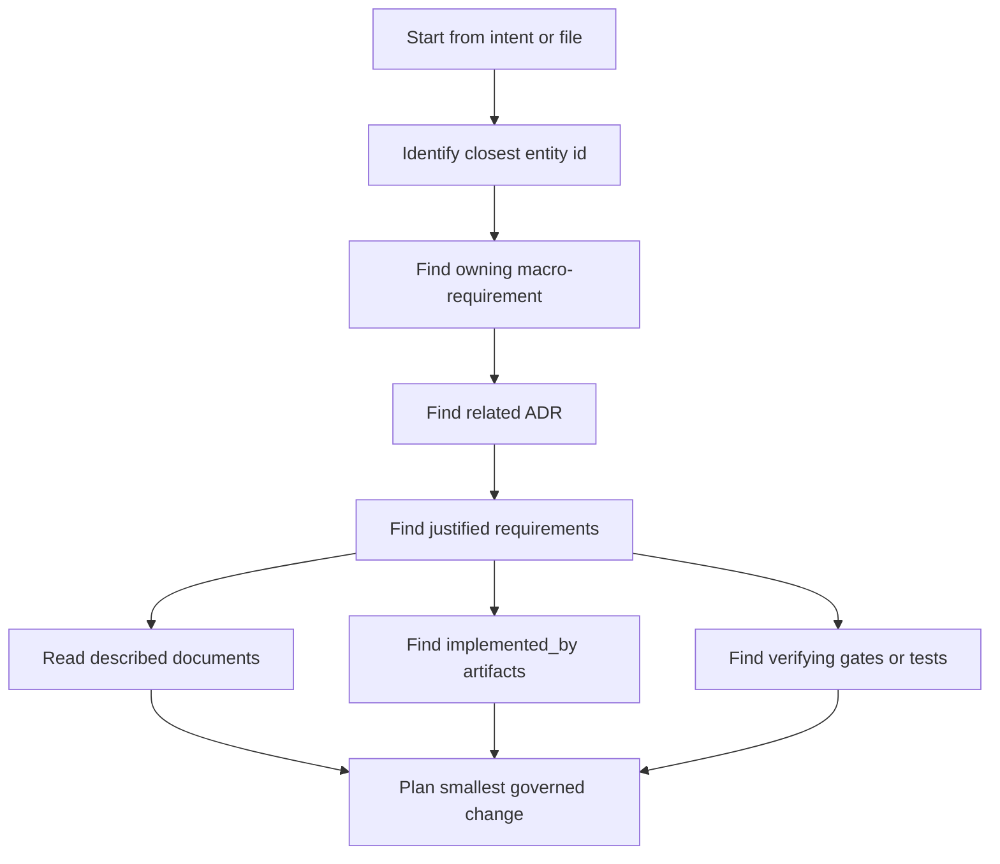

This procedure reduces the risk of writing duplicate code. It also helps an LLM gather evidence before proposing a micropasso.

## Example: studying this manual slice

This part of the manual is itself governed by graph relations.

```text
MR-0010
  has_decision -> ADR-0001
ADR-0001
  justifies -> MR-0010REQ-0003
MR-0010REQ-0003
  described_by -> DOC-MR0010-project-knowledge-governance-manual-part-02
```

The path says that this graph-and-traceability chapter is not a random note. It is an explanatory document connected to the requirement that defines the manual's diagram strategy and graph/code explanation responsibility.

## How graph checks prevent drift

Two recent deterministic semantic gates are central to graph-based governance.

### Controlled vocabulary consistency

This gate checks that governed status values do not diverge between a canonical owner registry, runtime contract and OpenAPI contract.

It protects this type of relationship:

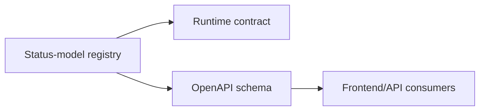

If a status appears in runtime but not in the governed owner registry, or if OpenAPI omits a governed status, the repository can fail closed.

### Graph and registry ownership consistency

This gate checks that graph relations and registry metadata agree on ownership and canonical decision origin.

It protects this relationship:

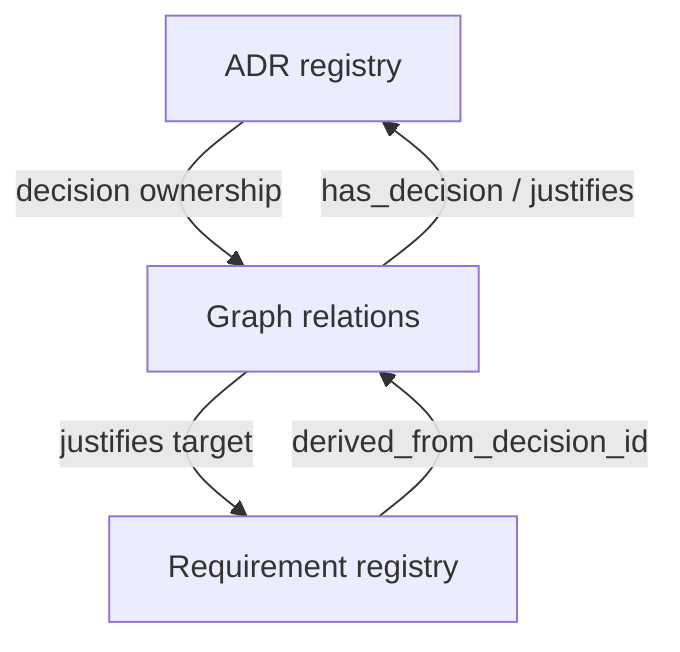

This is a semantic check because it verifies meaning, not only YAML formatting.

## Code traceability model

Threat-forge code must remain connected to project knowledge. The current code traceability model uses source scanning, JSDoc references and graph implementation artifact nodes.

The model protects the following idea:

```text
If a tool or source file implements governed behavior, it must cite the requirement or decision that authorized it.
```

A future maintainer should not need to guess why a checker exists. The checker should identify the requirement it implements, and the graph should link the requirement to the implementation artifact.

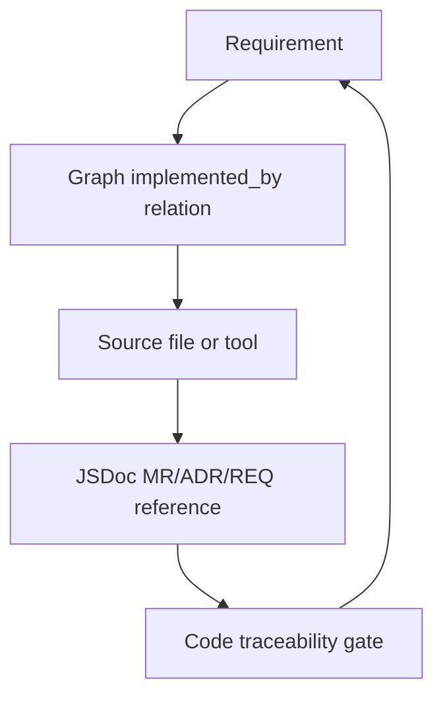

## How to study a tool

When you encounter a tool such as a repository gate, study it in this order:

1. Find the package script name.
2. Find the source file executed by the script.
3. Read the JSDoc or header traceability in the source file.
4. Find the requirement id cited by the source file.
5. Open the requirement registry entry and body.
6. Follow `derived_from_decision_id` to the ADR.
7. Open the graph and inspect `implemented_by` and `verifies` relations.
8. Run or inspect the negative fixture if one exists.

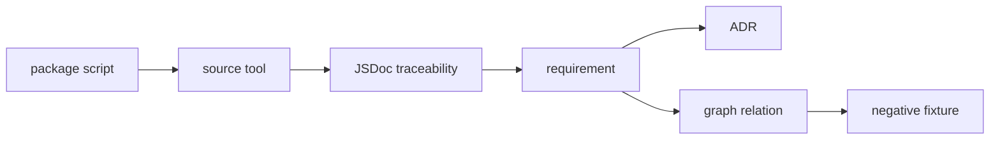

This route teaches the student how code, documents and tests are intentionally connected.

## How to avoid duplicate code

Duplicate code often appears when a developer starts from an implementation idea instead of a graph path. The safe workflow is:

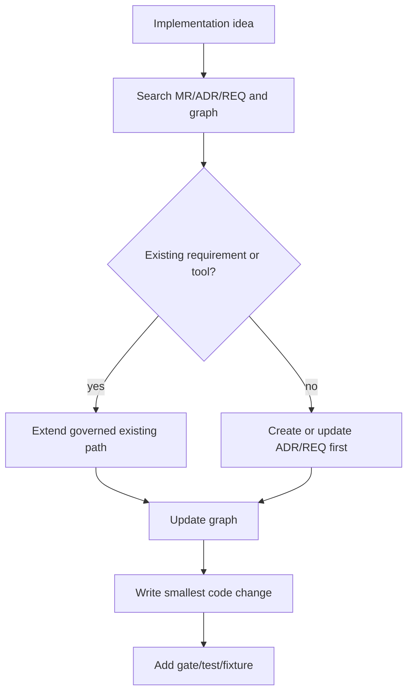

The question is not only whether similar code exists. The better question is:

```text
Does a governed requirement or graph path already own this behavior?
```

If yes, extend that path. If no, create the missing governance path first.

## Graph-guided LLM context

An LLM should not gather context through raw keyword search alone. Keyword search may return nearby words without showing authority or ownership.

The safer LLM route is:

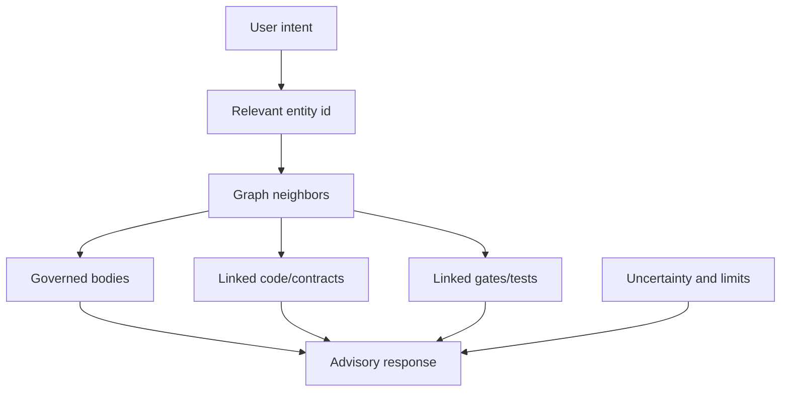

The LLM should cite evidence paths and ids. It should distinguish canonical sources from generated pages, PDF renderings and advisory reports.

## Impact analysis with the graph

Before changing a requirement, tool or contract, inspect its impact neighborhood.

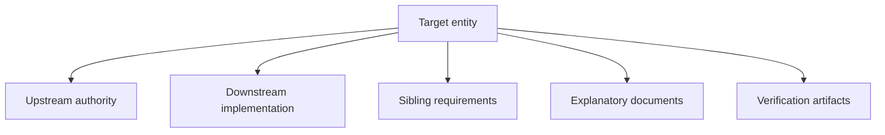

Questions to ask:

- Which ADR justified this requirement?
- Are there sibling requirements from the same ADR?
- Which tool or contract implements it?
- Which gate verifies it?
- Which manual section explains it?
- Would changing it make another graph relation incorrect?

This is how the graph supports safe refactoring and safe documentation expansion.

## Common graph failure modes

| Failure mode | Symptom | Why it matters |
|---|---|---|
| Missing `justifies` relation | Requirement registry has `derived_from_decision_id`, but graph lacks ADR -> REQ relation | LLM and humans cannot reliably identify canonical decision origin |
| Conflicting ownership | Registry says one MR, graph implies another | Creates ambiguous authority |
| Orphan document | Manual or explanation exists but graph does not link it | Study material is hard to discover |
| Orphan body | Body Markdown exists without registry reference | Canonical explanation is disconnected |
| Tool without requirement | Source exists without traceability | Implementation becomes undocumented behavior |
| Requirement without verification | Requirement exists but no gate/test checks it | Governance intent may not be enforced |

## Reading the graph for thesis work

For thesis writing, the graph can support a clear methodological explanation:

1. The project encodes architectural intent through ADRs.
2. ADRs justify requirements.
3. Requirements are represented in registries and explained in governed bodies.
4. Graph relations make traceability explicit and machine-readable.
5. Tools and gates verify that the implementation remains aligned with the documentation.
6. LLMs can use the graph as context but do not become sources of truth.

This gives the thesis a strong argument: threat-forge uses documentation not as passive text but as a controlled knowledge substrate for software governance and future threat analysis.

## Study exercise

To practice, choose one active gate and trace it:

1. Find the package script.
2. Find the tool file.
3. Find the requirement implemented by the tool.
4. Find the ADR that justified the requirement.
5. Find the graph node for the tool.
6. Find any negative fixture.
7. Explain what divergence the gate prevents.

If you can perform this exercise, you understand the main mechanism that keeps code and documentation coherent.

## Summary

The graph is the connector between project intent, governed documentation, implementation and verification. It is useful because it answers relationship questions that plain Markdown cannot answer reliably.

A developer should use the graph before changing code. A student should use the graph to study why the project is structured as it is. An LLM should use the graph to retrieve authoritative context and report evidence. Future child-project governance and threat analysis should build on the same principle: no important project knowledge should remain disconnected from the graph.
