# Part 03 - Deterministic gates catalog

Status: study-oriented manual chapter.

This chapter explains the active deterministic gate model used by threat-forge. It is written for students, developers and LLM-assisted reviewers who need to understand what `npm run repo:check` actually protects before they change documentation, code, contracts or child-project governance records.

This chapter is explanatory. It does not replace the canonical gate implementations, requirement registries, ADRs, graph registries, OpenAPI contract, runtime contracts or package scripts.

## 1. Why deterministic gates exist

threat-forge treats documentation as operational project knowledge. A project change is not only a Git diff: it changes the relationship between decisions, requirements, graph nodes, code, API contracts, tests, generated pages and future LLM context.

The deterministic gates exist to answer one question before a commit is accepted:

```text
Can the repository still prove that its documentation, graph, code and derived artifacts are coherent enough to be trusted?
```

A gate is deterministic when the same repository state produces the same result without relying on a subjective judgment. This is different from LLM semantic review. An LLM may help find ambiguity or duplication, but deterministic gates are the blocking control executed by `repo:check` and by the governed commit-push runner.

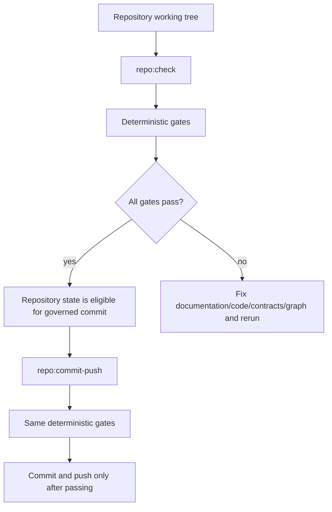

The important property is repeatability. A student, a developer, a CI runner and an LLM-assisted reviewer should be able to describe the same failure using the same canonical files and the same gate output.

## 2. Gate categories

The current gate sequence contains several kinds of checks. Some validate format, some validate traceability, some validate generated views, some validate runtime behavior, and some validate child-project governance scaffolding.

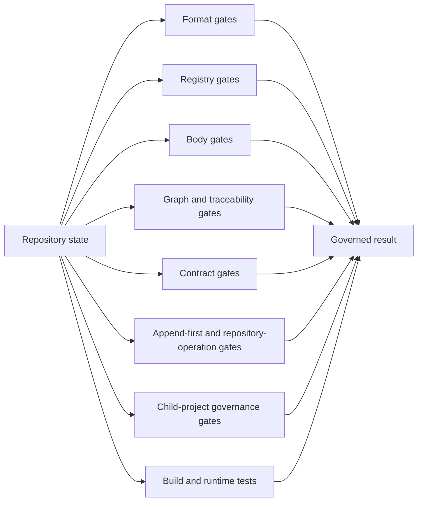

The categories are useful for study because they show what kind of divergence is being prevented.

| Category | Main question | Example protected divergence |
| --- | --- | --- |
| Format gates | Are files structurally readable? | malformed YAML, invalid graph structure, invalid body layout |
| Registry gates | Are governed records complete and consistent? | missing ADR/REQ fields, invalid taxonomy values |
| Body gates | Do governed Markdown bodies follow their declared profiles? | body missing mandatory sections |
| Graph and traceability gates | Do graph relations match registries and code? | requirement claims decision ownership but graph lacks `justifies` |
| Contract gates | Do runtime/API contracts remain coherent? | runtime enum diverges from OpenAPI or owner registry |
| Append-first gates | Are protected records modified safely? | historical registry/body changed without governed manifest |
| Child-project gates | Can child projects be planned, registered and inspected safely? | unsupported child documentation source silently falls back to platform docs |
| Build/test gates | Does runnable software still work? | frontend build breaks, runtime tests fail |

## 3. Anatomy of a gate

Every gate should be studied with the same model:

```text
Gate name
  input: files, registries, contracts or generated artifacts read by the gate
  rule: deterministic invariant checked by the gate
  output: pass/fail, counts, focused diagnostic information
  implemented requirement: REQ that justifies why the gate exists
  failure meaning: what type of project divergence was found
  correction path: which source must be fixed first
```

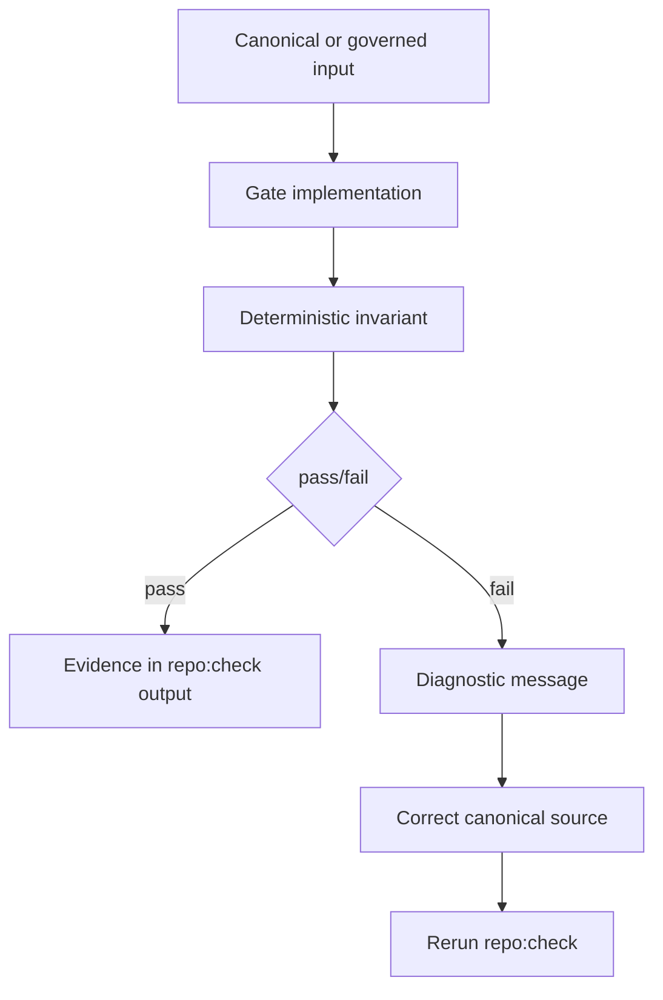

A gate should not hide its meaning. When a gate fails, the developer should be able to answer:

1. Which canonical source is inconsistent?
2. Which derived artifact, code path or graph relation exposes the inconsistency?
3. Which MR/ADR/REQ says that the invariant matters?
4. What is the smallest correction that restores coherence?

## 4. Governed repository runner

The runner is the outer control around all gates. The canonical commands are:

```powershell
npm run repo:check
npm run repo:commit-push -- "<message>"
```

The runner prevents the project from relying on ad-hoc Git operations. It checks the repository context, executes the governed gate sequence, stages non-ignored changes only after gates pass, creates the governed commit and pushes it to the configured upstream.

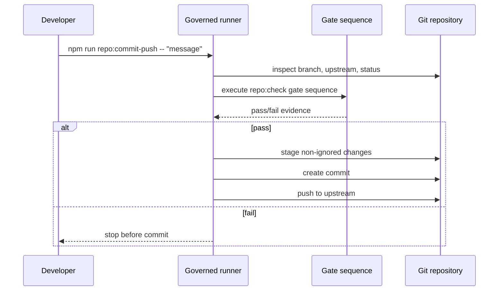

Study point: the runner is not merely convenience automation. It is part of the governance model. A commit is accepted only after the repository has re-proved the active invariants.

## 5. Format and structure gates

### 5.1 Graph format

Gate: `docs:graph-format`.

Purpose: prove that graph registry files follow the expected graph format and can be read by other graph consumers.

Typical inputs:

- graph registries under `docs/reference/project-model/registers/graph/`;
- graph node and predicate vocabulary;
- graph contract used by the validator.

What it protects:

```text
Malformed graph file
  -> graph renderer cannot read it
  -> Explorer or LLM context cannot trust relations
  -> repo:check must fail before commit
```

Typical correction path:

1. Inspect the graph file reported by the gate.
2. Fix malformed YAML, missing fields or invalid node/relation structure.
3. Rerun `npm run repo:check`.

### 5.2 Documentation structure

Gate: documentation structure check.

Purpose: prove that the expected Project Model layout exists and remains navigable.

Typical inputs:

- `docs/reference/project-model/`;
- known register/body directories;
- expected documentation skeleton.

What it protects:

```text
Missing Project Model path
  -> records can exist but become undiscoverable
  -> project documentation is no longer navigable
```

Typical correction path: restore the missing directory/file structure or move the file back into its governed location.

## 6. Registry gates

Registries are compact structured indexes for governed records. They allow the project to find entities without parsing long explanatory text.

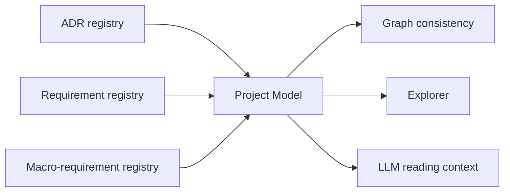

### 6.1 ADR registry fields

Gate: `docs:adr-registry-fields`.

Purpose: prove that ADR registry records contain the required governed fields.

Typical divergence prevented:

```text
ADR exists but lacks required ownership/status fields
  -> graph or Explorer cannot interpret it consistently
```

Correction strategy: fix the ADR registry record first, then ensure the ADR body and graph relation agree with the registry.

### 6.2 Requirement registry fields

Gate: `docs:requirement-registry-fields`.

Purpose: prove that requirement records conform to the requirement governance taxonomy.

Typical divergence prevented:

```text
Requirement exists but lacks implementation_state, acceptance, body_path or decision ownership
  -> developers cannot know whether the requirement is planned, implemented or verified
```

Correction strategy: update the requirement registry record according to the requirement governance registry and ensure the body path exists.

## 7. Body format gates

The body files are the long-form governed explanations for ADRs, requirements and macro-requirements. The body gates make sure these Markdown files remain parseable and structurally useful.

### 7.1 Body format registry

Gate: `docs:body-format-registry`.

Purpose: prove that the registry of body profiles is itself valid.

Why it matters: ADR and requirement bodies rely on named profiles. If the profile registry is invalid, downstream validators cannot decide which sections are mandatory.

### 7.2 Markdown body parser

Gate: `docs:markdown-body-parser`.

Purpose: prove that the shared Markdown body parser behaves as expected.

Why it matters: validators, documentation pages and future LLM context extraction depend on consistent parsing of governed bodies.

### 7.3 ADR body format

Gate: `docs:adr-body-format`.

Purpose: prove that ADR bodies follow the ADR functional-decision body profile.

Typical failure meaning:

```text
ADR body exists but omits a required decision section
  -> future readers know the ADR exists but not why it was accepted
```

### 7.4 Requirement body format

Gate: `docs:requirement-body-format`.

Purpose: prove that requirement bodies follow the functional or specialized requirement body profiles.

Typical failure meaning:

```text
Requirement body lacks scope, rationale, acceptance or traceability details
  -> developer may implement behavior without enough governed context
```

## 8. Graph and registry ownership consistency

Gate: `docs:graph-registry-ownership-consistency`.

Purpose: prove that macro-requirement, ADR and requirement ownership semantics agree across graph files and registries.

The gate currently checks graph files listed in `graph.index.yml` against decision and requirement registries. It verifies that:

- registered ADRs are represented by `MR has_decision ADR` relations;
- ADR ownership does not contradict its macro-requirement;
- registered requirements belong to their owning macro-requirement;
- each requirement `derived_from_decision_id` has a matching graph `ADR justifies REQ` relation.

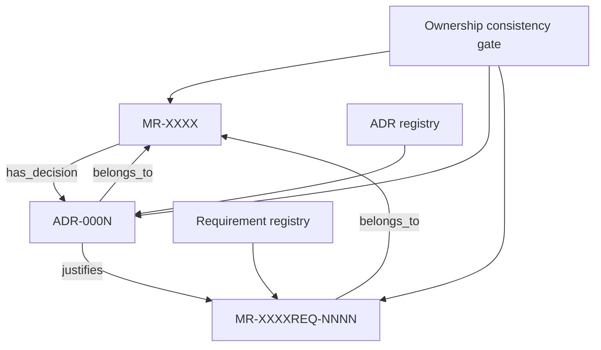

Typical failure:

```text
Requirement registry says derived_from_decision_id: ADR-0007
but graph does not contain:
  ADR-0007 justifies MR-XXXXREQ-NNNN
```

Meaning: the requirement may exist, but its decision ownership is not machine-verifiable through the graph.

Correction strategy:

1. Confirm the requirement really belongs to that ADR.
2. Add the missing `justifies` relation to the correct graph if the registry is right.
3. Correct the registry if the graph reveals the requirement is attached to the wrong decision.
4. Rerun `repo:check`.

Study point: this gate is one of the first deterministic semantic gates. It is not only checking YAML format; it checks governance meaning.

## 9. Code traceability gate

Gate: `docs:code-traceability`.

Purpose: prove that governed implementation artifacts and source files remain traceable to project requirements.

The code traceability model protects the project from undocumented implementation. Code that implements governed behavior should not appear as an isolated file with no relationship to MR, ADR, REQ or graph artifacts.

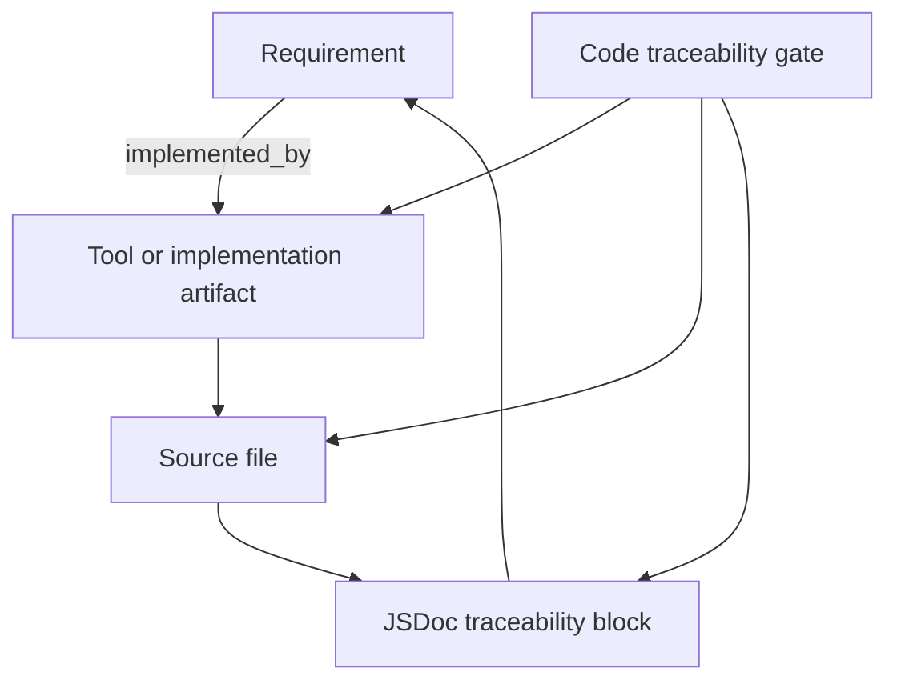

Typical divergence prevented:

```text
New tool added under backend/tools
but graph has no implementation artifact node
or JSDoc does not cite the implemented requirement
```

Why this matters for students:

- A file should be studied through the requirement it implements.
- A requirement should reveal the implementation artifacts that realize it.
- The graph should make navigation possible in both directions.

Why this matters for LLMs:

- The LLM should not infer purpose from filename alone.
- The LLM should retrieve the requirement and ADR before proposing code changes.
- The LLM should not create a parallel implementation when an existing governed artifact already implements the same requirement.

Correction strategy:

1. Identify the requirement the code implements.
2. Add or correct the graph implementation artifact node.
3. Add or correct the `implemented_by` relation.
4. Ensure the source file has the required JSDoc traceability.
5. Rerun `repo:check`.

## 10. Controlled vocabulary consistency

Gate: `docs:controlled-vocabulary-consistency`.

Purpose: prove that governed vocabulary owners and runtime/API surfaces do not diverge.

This is currently used for child-project governance status values. The owner registry defines status families; runtime contracts and OpenAPI schemas must expose compatible values.

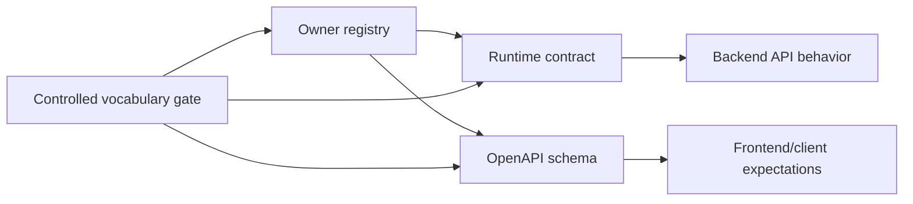

Typical failure:

```text
Owner registry includes not_executed
but runtime contract or OpenAPI schema omits it
```

Meaning: different layers of the system disagree about the same governed concept.

Correction strategy:

1. Identify the owner registry for the vocabulary.
2. Update runtime contract and OpenAPI only if the owner registry is correct.
3. If the owner registry is wrong, govern the registry correction first.
4. Rerun `repo:check`.

Study point: a controlled value is not just a string. It is part of a cross-layer contract.

### 10.1 Taxonomies as controlled field vocabularies

A taxonomy is more than a documentation label. In threat-forge, a taxonomy can define the allowed vocabulary for a governed field. When a field is controlled by a taxonomy, the field value is not free text: it must be one of the stable machine-readable identifiers declared by the governing vocabulary.

```text
field value = one selected identifier
taxonomy = set of allowed identifiers, labels and meanings
gate = deterministic check that the field uses only allowed identifiers
```

This distinction matters because humans and LLMs naturally use synonyms. A developer may write `done`, another may write `complete`, a UI may display `Completed`, and an LLM may propose `finished`. Those words are similar for a human, but they are different machine values. If they enter governed fields, filters, contracts and reports begin to drift.

The stable value is the `id`. Labels and descriptions are explanatory metadata.

```yaml
value id: implemented
label: Implemented
description: A governed implementation artifact is linked to the requirement.
```

A UI may display the label `Implemented`, but registries, contracts, graph-derived filters and LLM context should preserve the canonical id `implemented`.

### 10.2 Example: a taxonomy constraining a requirement field

Assume a requirement registry field named `status` is controlled by the requirement status vocabulary. A valid record uses one of the governed identifiers:

```yaml
id: MR-0010REQ-0003
title: Versionable diagram strategy for graph, gates, contracts and code
status: accepted
```

The field must not invent a synonymous value:

```yaml
id: MR-0010REQ-0003
title: Versionable diagram strategy for graph, gates, contracts and code
status: approved
```

Even if `approved` sounds close to `accepted`, it is not the same governed value unless the vocabulary explicitly defines it. The correction is not to teach every consumer that `approved` means `accepted`. The correction is to use the canonical value or govern a vocabulary extension.

```text
accepted is allowed -> pass
approved is not declared -> fail
```

This is the anti-drift role of taxonomy-controlled fields: one field, one vocabulary, one canonical value set.

### 10.3 Example: child-project status values across registry, runtime and OpenAPI

The child-project governance status model demonstrates the same idea across multiple layers. A status family defines governed values such as `pass`, `fail`, `warning` or `not_executed`. Runtime contracts and OpenAPI schemas must use the same canonical values.

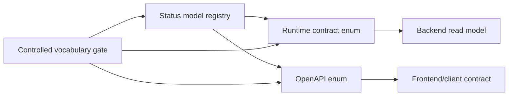

A coherent system says the same thing everywhere:

```text
owner registry:   not_executed
runtime contract: not_executed
OpenAPI schema:   not_executed
UI internal value: not_executed
```

A drifting system says similar but non-identical things:

```text
owner registry:   not_executed
runtime contract: skipped
OpenAPI schema:   not_run
UI internal value: pending
```

The second case is dangerous because every layer appears understandable to a human, but the project has lost a single governed language. Deterministic tools cannot reliably compare values, filters may miss records, and LLM context may merge concepts that the project never governed as equivalent.

### 10.4 What the gate should prove

A controlled vocabulary gate should answer four questions:

1. Which source owns the vocabulary?
2. Which fields are governed by that vocabulary?
3. Which consumers repeat the same allowed values?
4. Are there extra, missing or synonymous values outside the owner vocabulary?

For a taxonomy-controlled field, the intended invariant is:

```text
Every governed field value must be a member of the declared allowed value set.
Every repeated enum in runtime contracts, OpenAPI or UI-facing data must match the owner vocabulary.
No consumer may introduce a new synonym without a governed vocabulary change.
```

A useful diagnostic should point to both sides of the mismatch:

```text
Invalid value: approved
Field: requirement.status
Owner vocabulary: requirement_statuses
Allowed values: proposed, accepted, rejected, deprecated
Correction: use an allowed value or govern a new vocabulary value first
```

### 10.5 LLM rules for taxonomy-controlled fields

LLM-assisted development must be especially careful with taxonomies because LLMs often normalize concepts by meaning instead of by canonical identifier. In threat-forge, that is not safe for governed fields.

The LLM should:

- locate the field definition before proposing a field value;
- locate the taxonomy or owner registry that defines allowed values;
- use the stable `id`, not a display label or synonym;
- preserve exact spelling and casing of governed identifiers;
- ask for a governed vocabulary extension if no allowed value fits;
- explain when a proposed synonym is semantically close but not canonically allowed.

The LLM should not:

- invent `completed` when the canonical value is `implemented`;
- invent `approved` when the canonical value is `accepted`;
- treat UI labels as machine values;
- align runtime/OpenAPI/UI by local patching without checking the owner vocabulary first.

Study point: taxonomy-controlled fields are one of the simplest and strongest ways to keep documentation, code, API contracts, UI filters and LLM context speaking the same language.

## 11. OpenAPI contract structure

Gate: `docs:openapi-contract`.

Purpose: prove that the public API contract remains structurally valid for the currently governed read-only surfaces.

What it protects:

```text
Backend route exists or changes
but OpenAPI schema/operation becomes invalid or incomplete
```

Why it matters:

- frontend code should consume governed API contracts;
- external readers can understand API shape;
- child-project APIs and documentation APIs stay visible and checkable;
- LLMs can reason about API boundaries from a canonical contract instead of guessing from source files.

Correction strategy: update OpenAPI definitions and schemas together with runtime contract changes, then rerun the gate.

## 12. Project Documentation Explorer JSDoc type-check

Gate: `docs:project-documentation-explorer-jsdoc-typecheck`.

Purpose: statically type-check selected JavaScript/JSDoc-covered Project Documentation Explorer code.

This gate supports the project decision to use JSDoc as a traceability and type-safety bridge without converting the whole codebase to TypeScript at once.

Typical failure:

```text
A JSDoc typedef or function contract no longer matches the implementation
```

Correction strategy:

1. Fix the implementation if the contract is correct.
2. Fix the JSDoc contract if the implementation intentionally changed and the governed requirement supports the change.
3. Ensure the graph/code traceability still points to the correct requirement.

## 13. Generated Project Model pages

Gate: `docs:pages`.

Purpose: regenerate project-model HTML pages from canonical registries and graph files.

Generated pages are derived artifacts. They help humans inspect the Project Model, but they do not replace registries or graph files.

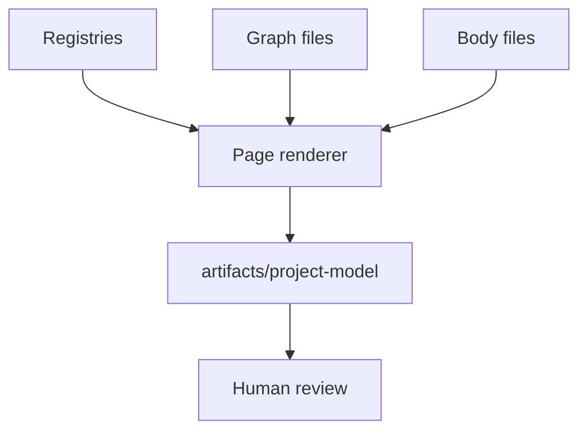

Typical failure:

```text
Renderer cannot read a registry, graph or body path
```

Correction strategy: fix the canonical source, not the generated page, unless the renderer itself is the governed implementation being changed.

## 14. Orphan governed body files

Gate: `docs:orphan-governed-bodies`.

Purpose: prove that governed Markdown body files are referenced by registries.

Typical failure:

```text
A governed body file exists but no registry points to it
```

Meaning: there is explanatory content that cannot be discovered through the canonical indexes.

Correction strategy:

1. Add the missing registry reference if the body is valid.
2. Remove or relocate the body only through governed rules if it is invalid or obsolete.
3. Rerun `repo:check`.

Study point: discoverability is part of governance. A hidden body is almost as dangerous as a missing body.

## 15. Append-first protected records

Gate: `docs:append-first`.

Purpose: protect historical governed records from silent modification.

threat-forge prefers append-first evolution. Instead of rewriting history, the project adds new ADRs, requirements, manifests or consolidation records that explain why a change is needed.

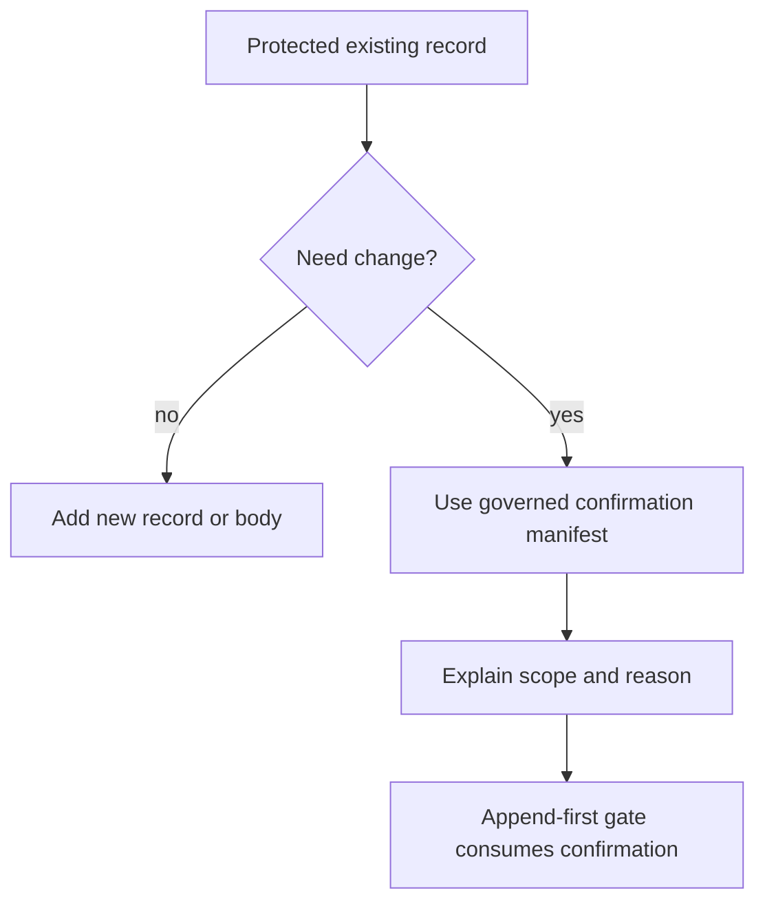

Typical failure:

```text
Existing protected ADR, requirement or registry record changed directly
without an accepted confirmation manifest
```

Correction strategy:

1. Prefer a new ADR/REQ/body section if the change is conceptual evolution.
2. Use a governed confirmation manifest only when an existing protected record truly must be corrected.
3. Keep the correction narrow and explain the reason.

## 16. Lockfile registry and integrity

Gate: `docs:lockfile-integrity`.

Purpose: prove that package lockfile entries remain consistent with the allowed registry/integrity policy.

This protects the project from accidental dependency-source drift.

Typical failure:

```text
package-lock contains an unexpected registry prefix or missing integrity outside allowed cases
```

Correction strategy: inspect dependency changes, ensure package updates are intentional, and rerun the governed check.

## 17. Child-project governance gates

Child-project gates are currently mostly scaffolding, contracts and self-tests. They do not yet mean that real child projects have full governed execution and Knowledge Graph ingestion.

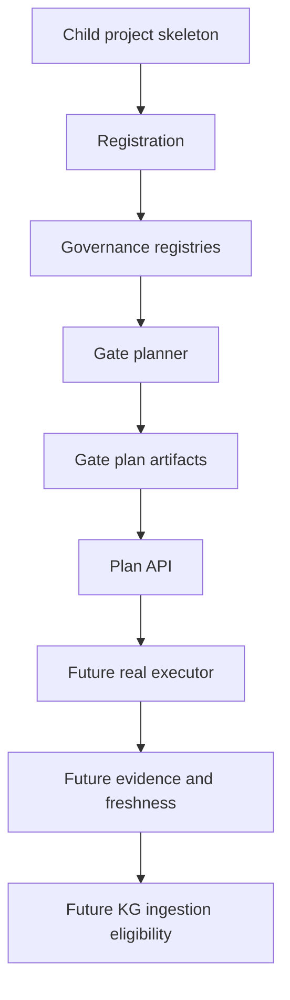

### 17.1 Child project standard Project Model skeleton

Purpose: prove that a child project contains the required Project Model skeleton and can delegate to core validators.

What it protects: child projects must be analyzable as governed documentation projects, not arbitrary folders.

### 17.2 Demo child-project workspace reset

Purpose: prove that a demo child workspace can be recreated from a minimal governed child-project seed.

What it protects: local demos and tests have a reproducible child-project workspace.

### 17.3 Demo child-project SQLite registration

Purpose: prove that a demo child project can be registered with local SQLite-backed management state.

What it protects: child-project management examples can be tested without relying on external infrastructure.

### 17.4 Child project management API serve self-test

Purpose: prove that read-only child-project management APIs can serve a list and detail endpoint.

What it protects: frontend/UI integration has a stable read-only API surface.

### 17.5 Child project governance registry contract

Purpose: prove that child-project governance registries contain valid applicability classes, capabilities, profiles, gates, validation surfaces and statuses.

What it protects: gate planning is driven by governed registries rather than hardcoded UI assumptions.

### 17.6 Child project governance gate planner

Purpose: prove that governance profiles can be evaluated into gate plans for platform, demo child and documentation-only child contexts.

What it protects: child-project gate selection is explainable and profile-driven.

### 17.7 Child project governance gate plan artifacts

Purpose: prove that the planner can emit plan artifacts for inspection.

What it protects: planned gates can be reviewed as artifacts rather than only console output.

### 17.8 Child project governance plan API serve self-test

Purpose: prove that gate plan artifacts can be served through read-only APIs.

What it protects: the UI can expose planned governance without executing real child-project gates yet.

Important boundary:

```text
Current child-project gates prove planning, contracts, scaffolding and read-only APIs.
They do not yet prove real child-project gate execution, persisted evidence, freshness or KG ingestion eligibility.
```

## 18. Frontend build and runtime tests

### 18.1 Frontend build

Gate: `frontend:build`.

Purpose: prove that the Governance Console frontend still builds after Project Documentation Explorer and child-project UI changes.

The frontend build also regenerates the Project Documentation Explorer snapshot before running Vite.

### 18.2 Runtime unit tests

Gate: `test:runtime`.

Purpose: prove selected runtime behavior for the Project Documentation Explorer and child documentation source handling.

The current runtime tests cover read-only HTTP serving, entity details, error mapping, snapshot fallback, child documentation source behavior, path traversal protections, cache behavior and frontend data-source configuration.

Study point: runtime tests complement documentation gates. Documentation gates prove governed knowledge consistency; runtime tests prove executable behavior.

## 19. How to read a gate failure

When a gate fails, do not start by editing random files. Use the following route.

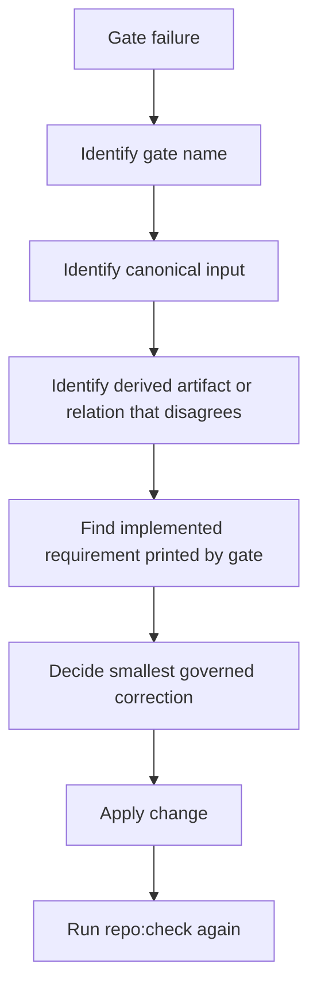

Practical checklist:

1. Read the gate name and its printed counts.
2. Identify whether the failure is format, registry, graph, contract, append-first, child-project, build or test related.
3. Fix the canonical source first.
4. Do not patch generated artifacts as the primary fix.
5. Do not invent a new code path if an existing requirement/tool already covers the behavior.
6. Rerun `npm run repo:check`.
7. Commit only through `npm run repo:commit-push -- "<message>"`.

## 20. How gates prevent code/documentation divergence

The active gates form a layered defense. No single gate understands the whole project. Together, they reduce the chance that code, documentation and graph drift apart.

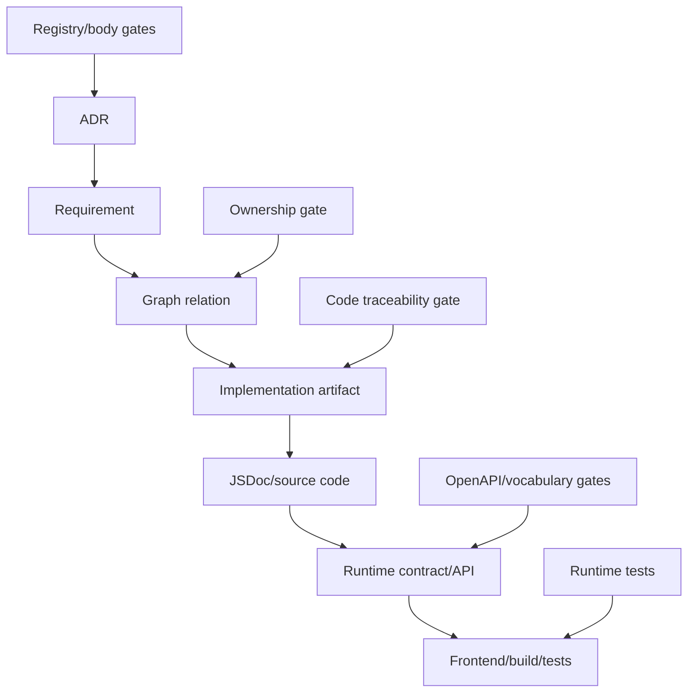

Examples:

| Divergence | Gate layer that should catch it |
| --- | --- |
| Requirement body exists but registry does not reference it | orphan governed body gate |
| Requirement claims an ADR but graph lacks `justifies` | graph and registry ownership gate |
| New tool lacks requirement traceability | code traceability gate |
| Runtime status enum diverges from OpenAPI | controlled vocabulary consistency gate |
| Existing protected registry modified directly | append-first gate |
| UI build breaks after documentation API changes | frontend build |
| Path traversal becomes possible in body loading | runtime tests |

## 21. LLM usage rules for gate work

An LLM can help explain and debug gate failures, but it must follow the same evidence route as a human.

The LLM should:

- quote the gate name;
- identify the canonical file paths involved;
- identify the MR/ADR/REQ if available;
- explain the failure type;
- propose the smallest governed correction;
- state uncertainty if the gate output is incomplete;
- avoid writing code before requirement and graph ownership are understood.

The LLM should not:

- treat generated pages or snapshots as canonical sources;
- propose direct Git commands outside the governed runner;
- silently rewrite protected records;
- infer a requirement only from a filename;
- create a duplicate tool when an existing implementation artifact already satisfies the requirement.

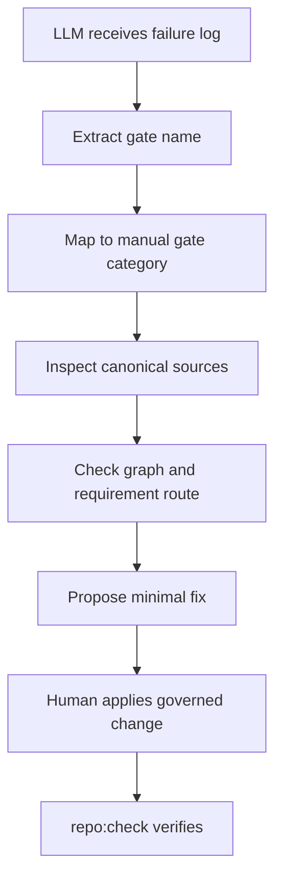

## 22. Student study exercise

To study the gate model, take one recent `repo:check` log and annotate it line by line.

For each gate, write:

```text
Gate:
Category:
Implemented requirement printed:
Inputs mentioned:
Counts printed:
What divergence it would catch:
How I would fix a failure:
```

Then draw a local diagram showing how at least three gates protect the same change. For example, a new backend tool may involve:

```text
requirement registry fields
+ graph ownership consistency
+ code traceability
+ runtime tests
+ repository operation governance
```

This exercise is useful because threat-forge is easier to understand as a set of connected invariants rather than as a list of scripts.

## 23. Developer checklist before adding code

Before adding a new implementation artifact, answer these questions:

1. Which macro-requirement owns the work?
2. Which ADR justifies the requirement?
3. Which requirement specifies the behavior?
4. Does an existing tool already implement the same requirement?
5. Does the graph contain the required ownership and implementation relations?
6. Does the source file include the required JSDoc traceability?
7. Does the change affect runtime contracts or OpenAPI?
8. Does the change affect frontend snapshots or runtime tests?
9. Does the change modify protected historical records?
10. Can `repo:check` prove the repository is still coherent?

If any answer is unknown, stop and study the graph and registries before writing code.

## 24. Summary

Deterministic gates are the executable part of threat-forge governance. They do not replace human design judgment, and they do not replace LLM semantic review. Their role is narrower and stronger: they make selected invariants repeatable, inspectable and blocking.

For the current state of threat-forge, the most important study lesson is:

```text
Documentation explains the project.
Registries index the project.
The graph connects the project.
Code implements the project.
Gates prove that these layers have not diverged.
```

The next manual chapter should study contracts and code coherence in more detail, using concrete examples from runtime contracts, OpenAPI, source files, JSDoc traceability and frontend view-models.
