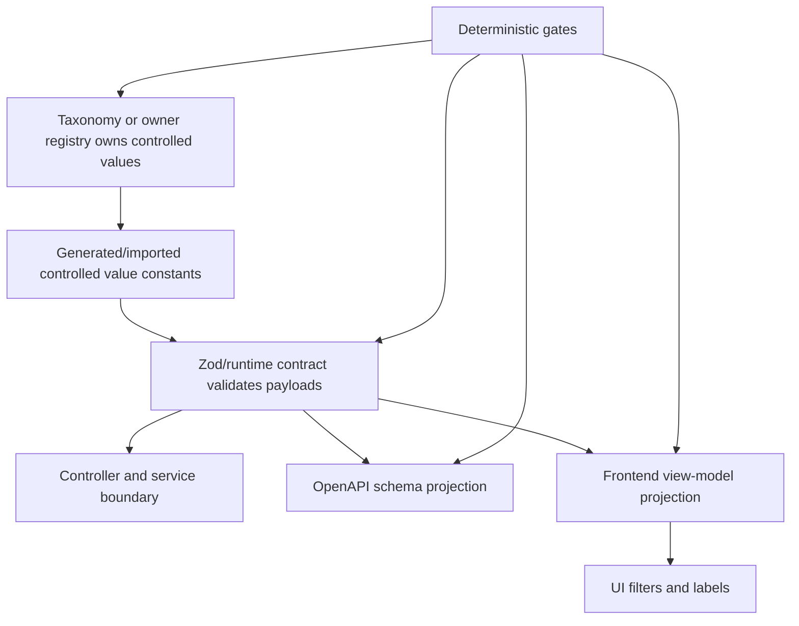
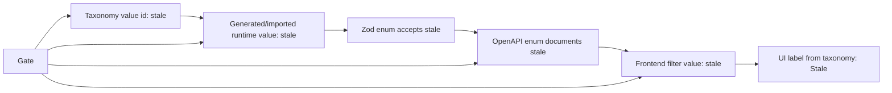
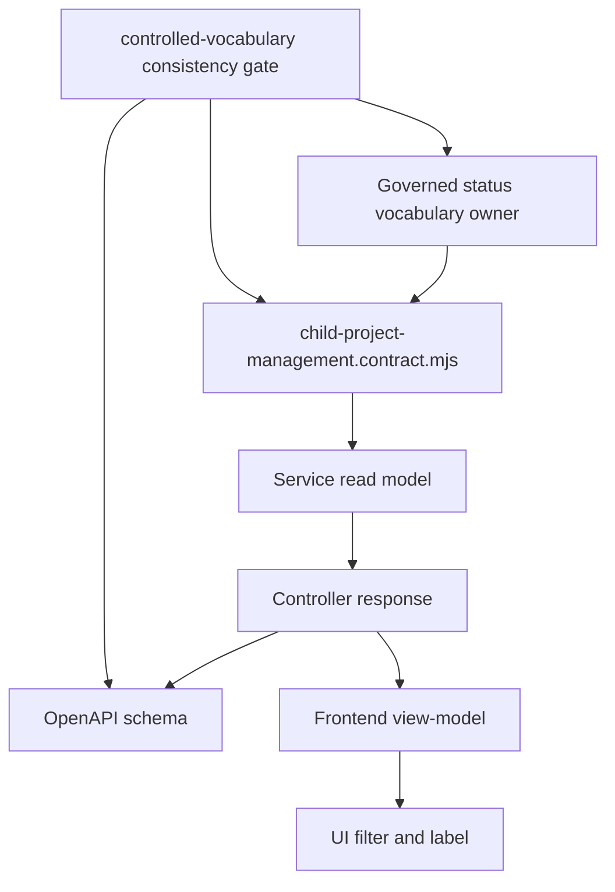
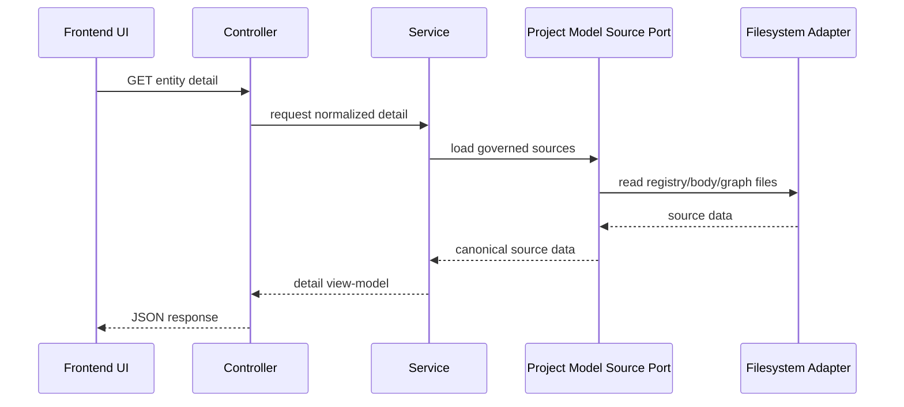
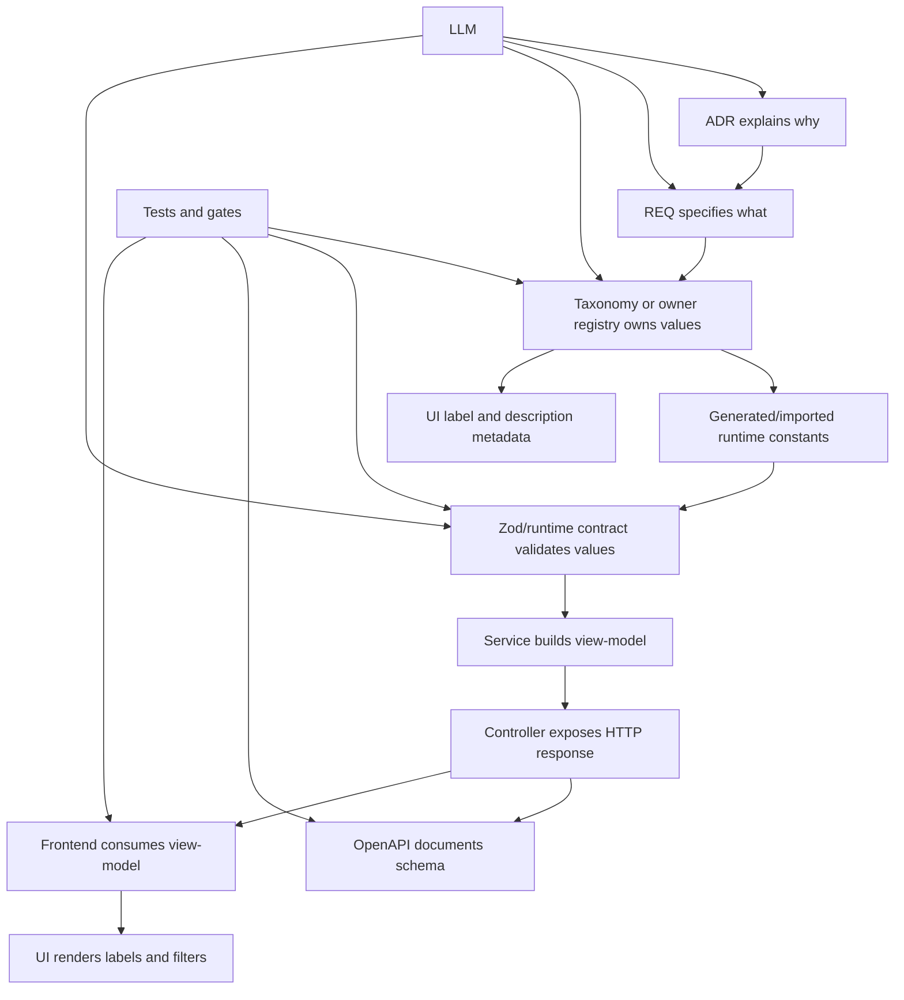
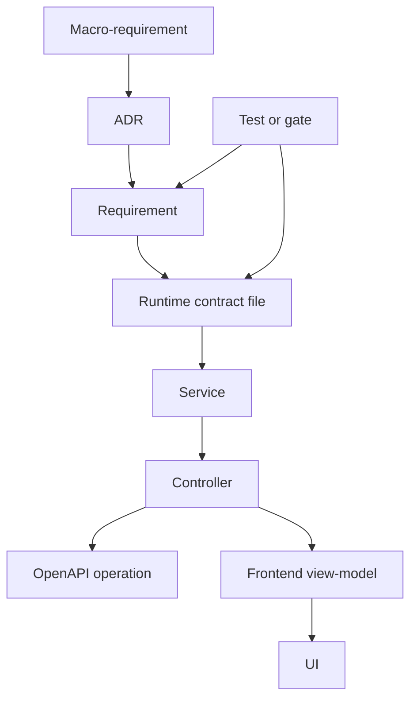

# Part 04 - Runtime contracts and API coherence model

Status: study manual chapter.

This chapter explains how threat-forge keeps executable backend shapes, public API descriptions, frontend view-models and UI filters aligned with governed documentation. It focuses on runtime contracts because they are the bridge between canonical project knowledge and code that actually runs.

This chapter is explanatory. It does not replace ADR, requirement, registry, graph, contract, OpenAPI, tool, test or gate sources.

> **Current-state alert - taxonomy centrality is not complete yet.**
>
> The intended model is taxonomy-centric: a taxonomy or owner registry should be the central source for controlled field values, and Zod/runtime contracts, OpenAPI schemas, frontend view-models and UI labels should be derived from it or deterministically associated with it.
>
> The current implementation is still an intermediate model. Threat-forge has a deterministic controlled-vocabulary consistency gate that checks selected owner registry values against selected runtime contract and OpenAPI projections, but the Zod contract does not yet generally import or generate all controlled values directly from taxonomy registries. In other words, the project currently prevents selected drift by verification; it does not yet eliminate physical duplication by generation.
>
> This is a high-priority improvement: taxonomy-controlled fields should declare or derive their association with runtime contracts, OpenAPI schemas and UI projections, and gates should prove that those associations do not drift.

## 1. Learning goals

After studying this chapter, a student or developer should be able to answer these questions:

- What is a runtime contract in threat-forge?
- Why is a runtime contract different from a registry, a taxonomy, OpenAPI and a frontend view-model?
- Why is a runtime contract not an optional duplicate of documentation?
- How does a governed value travel from a registry or taxonomy to backend code, OpenAPI, frontend filters and UI labels?
- How do gates detect drift between registry values, runtime enum values, OpenAPI enum values and UI-facing values?
- Where should a developer change code when adding a new field, enum, API payload or view-model?
- What should an LLM read before proposing a contract or API change?

The chapter prepares the next chapter, which studies the programming patterns in detail.

## 2. The core idea

A runtime contract is executable documentation for data crossing a software boundary.

In threat-forge, a runtime contract says:

```text
This payload is valid.
This payload is invalid.
This field is required.
This field is optional.
This enum may contain only these values.
This API response has this shape.
This frontend view-model must not expose internal storage details.
```

A registry or taxonomy defines governed project knowledge. A runtime contract makes selected parts of that knowledge executable at runtime. The target model is taxonomy-centric: the taxonomy owns controlled values, while the runtime contract applies them.



The current implementation is a stepping stone toward that target. Some controlled values are still duplicated in contract and OpenAPI files, but selected mappings are checked by deterministic gates.

The important rule is:

```text
The taxonomy or owner registry must own the governed vocabulary.
The contract must execute that vocabulary.
It must not become a second source of truth.
```

If documentation says a child-project gate status can be `pass`, `fail` or `stale`, the runtime contract must not silently use `done`, `error` or `outdated`.

## 3. Why contracts exist

Without runtime contracts, a project can drift in several ways.

### 3.1 Shape drift

One part of the system expects:

```json
{
  "id": "demo-child-project",
  "name": "Demo child project",
  "latest_check_run": null
}
```

Another part starts returning:

```json
{
  "projectId": "demo-child-project",
  "displayName": "Demo child project",
  "checkRun": null
}
```

Both payloads may be reasonable, but if the change is not governed then the frontend, API documentation and tests can disagree.

A contract prevents this by defining the accepted shape.

### 3.2 Value drift

One part of the system uses:

```text
not_implemented
```

Another part uses:

```text
todo
```

Another uses:

```text
pending
```

These are human-similar but machine-different values. Contracts and taxonomy-controlled fields prevent this drift.

### 3.3 Boundary drift

A frontend component should not know where the backend stores registry files. A controller should not expose filesystem paths that are not part of the API model. A service should not depend directly on a browser filter. A contract protects the boundary by saying which fields are safe to expose.

### 3.4 Error drift

If one controller maps missing data to 404, another maps it to 500, and another searches for text inside error messages, the API becomes fragile. Runtime contracts and typed errors help keep behavior explicit and testable.

### 3.5 Documentation drift

If OpenAPI says an endpoint returns `items`, but the backend returns `records`, the published API contract is stale. The OpenAPI gate and runtime tests reduce that drift.

## 4. The layered coherence model

Threat-forge uses several layers. Each layer has a different job.

```text
Canonical knowledge layer
  ADR, REQ, registries, taxonomies, graph

Executable validation layer
  runtime contracts, parser helpers, typed errors

Application layer
  controllers, services, ports, adapters

Published interface layer
  OpenAPI, route descriptors, read-only API endpoints

Presentation layer
  frontend view-models, filters, detail panels, labels

Verification layer
  repo:check, contract gate, runtime tests, frontend build
```

A student should not collapse these layers into one concept. They are connected, but not identical.

## 5. Canonical knowledge layer

The canonical knowledge layer contains the governed project facts.

Examples:

```text
ADR says why a choice exists.
REQ says what must be true.
A taxonomy says which values are allowed.
A graph relation says how entities are connected.
A registry record stores governed metadata.
A body Markdown file stores governed explanation for an ADR or REQ.
```

This layer is versioned and governed. Runtime code should implement it, not replace it.

## 6. Executable validation layer

The executable validation layer translates selected governed rules into runtime checks.

In threat-forge this is commonly done with Zod schemas in files named like:

```text
backend/src/<MR>/<feature>/<feature>.contract.mjs
```

Examples already present in the project include:

```text
backend/src/MR-0002/project-documentation-explorer/project-documentation-explorer.contract.mjs
backend/src/MR-0003/child-project-management/child-project-management.contract.mjs
```

A contract module usually exports:

- enum schemas;
- object schemas;
- route descriptor schemas;
- capability constants;
- parser helpers such as `parse...` functions.

For taxonomy-controlled fields, the target pattern is that enum values are generated from, imported from or deterministically checked against the owner taxonomy or registry. The contract file should not be treated as the semantic owner of those values.

It should not read files, open databases, start servers or mutate project state.

## 7. Runtime contract as executable boundary

A runtime contract is not simply a TypeScript type or a comment. It validates data at runtime.

For example, the current codebase may contain an enum list inside a contract file:

```js
export const childProjectGateStatusSchema = z.enum([
  "pass",
  "fail",
  "warning",
  "not_executed",
  "skipped",
  "reserved",
  "unknown",
]);
```

This is executable, but it is not the ideal final ownership model if the values are taxonomy-controlled. The target is to build or verify this enum from the owner registry or taxonomy, not to let this list become an independent vocabulary.

This means a payload with:

```json
{ "status": "pass" }
```

is valid, while a payload with:

```json
{ "status": "completed" }
```

is invalid unless `completed` is first introduced through governed documentation and aligned across the relevant contracts and API schemas.

## 8. Contracts are not the same as taxonomies

A taxonomy defines a controlled vocabulary. A runtime contract enforces selected vocabulary rules at runtime.

```text
Taxonomy or owner registry:
  canonical source of allowed values, meaning, label, description, order, color and lifecycle state

Runtime contract:
  executable validator that accepts or rejects payload values using that governed vocabulary
```

The contract should not invent a vocabulary. It should implement the governed vocabulary.

### 8.1 Current implementation: checked duplication

At the current stage, threat-forge does not yet generally generate every Zod enum from taxonomy registries. Some values are still physically repeated in multiple places:

```text
owner taxonomy or registry
runtime contract enum
OpenAPI enum
frontend exposed controlled values
```

The project mitigates this through deterministic checks. The controlled-vocabulary consistency gate treats the owner registry as the source for selected mappings and checks that the runtime contract and OpenAPI projections do not drift from it.

This means the current model is:

```text
canonical owner exists
  + duplicated projections still exist
  + deterministic gate checks selected equality
```

This is useful and already prevents selected drift, but it is not the final desired model.

### 8.2 Target implementation: taxonomy-derived contracts

The target model is stronger:

```text
taxonomy or owner registry
  -> generated or imported runtime constants
  -> Zod schema built from those constants
  -> OpenAPI enum generated from or checked against the same source
  -> frontend controlled values and labels generated from or loaded from the same source
```

In that model, the taxonomy is not merely checked after the fact. It becomes the central source from which executable and presentation projections are derived.

### 8.3 Why the distinction matters

Checked duplication still requires developers to edit several files. A gate can catch mistakes, but humans can still create the mistake first. Taxonomy-derived contracts reduce the chance of the mistake by design.

```text
Checked duplication:
  safer than free strings, but still repetitive

Taxonomy-derived projection:
  safer and less repetitive, because values flow from the owner
```

### 8.4 Machine value versus label

Taxonomies should also separate machine values from human labels.

```yaml
- id: completed
  label: Finished
  description: The workflow completed successfully.
```

Here the machine value is `completed`. The UI label is `Finished`. Changing the label can be centralized in the taxonomy. Changing the machine value is a governed migration because existing registries, artifacts, snapshots, API clients and tests may already depend on it.

The rule is:

```text
Canonical values should be stable.
Labels can change centrally through taxonomy metadata.
Renaming a canonical value requires a governed migration.
```

### 8.5 Contract association requirement

A controlled field should be able to answer these questions:

```text
Which taxonomy or owner registry owns my allowed values?
Which runtime contract applies those values?
Which OpenAPI schema projects those values?
Which UI/view-model exposes those values or labels?
Which gate proves that the projections do not drift?
```

That association is the missing strengthening step. The working plan should treat it as a priority before threat-forge relies on broader LLM-assisted development, real child-project execution or threat-analysis ingestion.



The UI may show a human label such as `Stale`, but the canonical machine value remains `stale`.

## 9. Contracts are not the same as OpenAPI

OpenAPI describes the public HTTP API. A runtime contract validates payloads inside the backend.

They must agree, but they are not the same artifact.

```text
Runtime contract:
  Used by backend code to validate data while code runs.

OpenAPI:
  Used by humans, clients and tools to understand the HTTP API.
```

If the runtime contract accepts `unknown` but OpenAPI does not document `unknown`, the API description is incomplete. If OpenAPI documents `completed` but runtime rejects it, the published contract lies.

The OpenAPI contract gate catches selected structure-level problems. The controlled vocabulary consistency gate catches selected enum drift where mappings are governed.

## 10. Contracts are not the same as frontend view-models

A view-model is the UI-safe shape consumed by the frontend.

A runtime contract can define a view-model, but the view-model itself is not the internal storage model.

For example, the Project Documentation Explorer view-model exposes:

```text
id
title
kind
implementation_state
acceptance_state
source_references
incoming_relations
outgoing_relations
body
filters
```

The frontend does not need to know how the backend read YAML registries, Markdown bodies or graph files. It receives a normalized shape.

This is important for students: do not make React components read registry files directly. React consumes a stable view-model produced by the backend.

## 11. Contracts are not the same as storage models

A storage model describes how data is persisted. A runtime contract describes what the application accepts and exposes.

For child-project management, the code may use SQLite internally. But the contract should avoid making SQLite tables the domain language of the API.

The contract exposes concepts such as:

```text
child project
repository location
documentation source
lifecycle policy
check run
gate result
violation
operational state
```

Those are application concepts, not raw table rows.

## 12. End-to-end example: child-project status values

A child-project status value may appear in several places:

```text
Governed owner registry or taxonomy
Runtime contract enum
OpenAPI enum
Backend service output
Frontend filter value
UI label
LLM prompt or report
```

The allowed value must remain stable.



### 12.1 Current good path: checked alignment

The status owner registry defines status families and values, including gate execution result values such as `pass`, `fail`, `warning` and `not_executed`, plus explicitly governed transitional runtime values where applicable.

The runtime contract contains the corresponding runtime enum. OpenAPI documents the corresponding public enum. The controlled-vocabulary consistency gate checks the governed mapping so that selected runtime and OpenAPI projections do not drift from the owner.

This is good because drift is detected. It is still not ideal because the values are physically repeated.

### 12.2 Target good path: generated or imported values

The stronger future path is:

```text
status-model.registry.yml
  -> generated/imported childProjectGateExecutionStatusValues
  -> z.enum(childProjectGateExecutionStatusValues)
  -> OpenAPI enum generated or checked from the same values
  -> frontend controlled-value metadata loaded from the same owner
```

In this model, changing a label or description happens once in the owner registry. Changing a canonical id still requires a governed migration.

### 12.3 Bad path

A developer adds this value in the runtime code:

```js
"completed"
```

but does not update the governed owner vocabulary, OpenAPI and UI-facing filter behavior.

That creates drift.

```text
Registry owner: pass, fail, warning, not_executed
Runtime:        pass, fail, warning, not_executed, completed
OpenAPI:        pass, fail, warning, not_executed
Frontend:       pass, fail, warning, not_executed
```

A deterministic gate should reject this when the field is in a governed mapping.

### 12.4 Correction path

Do not patch only the failing file. Follow the governed path:

```text
1. Explain why the new value is needed.
2. Add or update ADR/REQ if the behavior changes.
3. Update the owner taxonomy or status registry append-first.
4. Regenerate, import or update runtime contract values according to the governed projection model.
5. Update or regenerate OpenAPI enum.
6. Update UI labels or filter descriptions from the owner metadata if needed.
7. Add or adjust negative fixtures if the gate behavior changed.
8. Run repo:check.
```

If the value is only a label, do not add a new machine value. Use a UI label or description.

## 13. End-to-end example: Project Documentation Explorer implementation state

The Project Documentation Explorer exposes implementation-state information in a UI-safe way.

A simplified contract idea is:

```js
export const implementationStateSchema = z.enum([
  "implemented",
  "partially_implemented",
  "not_implemented",
  "not_applicable",
  "unknown",
]);
```

The frontend filter may show labels such as:

```text
Implemented
Partially implemented
Not implemented
Not applicable
Unknown
```

But the machine values remain:

```text
implemented
partially_implemented
not_implemented
not_applicable
unknown
```

The rule is:

```text
Label can be friendly.
Value must be canonical.
```

This allows the UI to be readable while the backend, OpenAPI, tests and LLM context stay precise.

## 14. End-to-end example: Project Documentation Explorer detail view

The detail endpoint for a documentation entity needs to expose several things:

```text
access decision
item metadata
incoming graph relations
outgoing graph relations
body content
taxonomy details
taxonomy-controlled field explanations
```

The runtime contract defines a view-model shape for this. The service builds it. The controller serializes it. The frontend renders it.

The frontend does not reconstruct graph relations itself by reading YAML. It asks the backend for a governed read model.



The contract protects the JSON boundary. The service protects the domain transformation. The adapter protects the concrete filesystem access.

## 15. The developer decision: where does a field belong?

When adding a new field, ask these questions before touching code.

### 15.1 Is the field canonical project knowledge?

If yes, it probably belongs in a registry or governed body first.

Examples:

```text
requirement type
implementation state
acceptance state
decision type
status taxonomy value
macro-requirement ownership
```

### 15.2 Is the field only derived for UI convenience?

If yes, it may belong in a view-model, not in a canonical registry.

Examples:

```text
filter count
selected filter flag
rendered label
summary totals
```

### 15.3 Is the field a runtime operational state?

If yes, it may belong in a runtime contract and storage model, but still needs a governed decision if it changes system behavior.

Examples:

```text
latest_check_run
gate_results
violations
repository_head
checked_at
```

### 15.4 Does the field cross an HTTP boundary?

If yes, it must be represented in OpenAPI if it is part of the public API.

### 15.5 Does the field appear in a frontend filter or UI detail panel?

If yes, the frontend must consume it through a view-model, not by inventing a parallel interpretation.

## 16. Contract change checklist

Before changing a runtime contract, use this checklist:

```text
1. Identify the governing MR, ADR and REQ.
2. Identify whether the change touches a taxonomy-controlled field.
3. Check whether OpenAPI must change.
4. Check whether frontend view-models or filters must change.
5. Check whether tests must change.
6. Check whether graph relations need a new implementation artifact or document node.
7. Check whether the change is explanatory only or runtime behavior.
8. Run repo:check.
```

If you cannot identify the governing MR/ADR/REQ, stop and document the requirement first.

## 17. Contract files should be side-effect free

A contract file should normally have no side effects.

It may export:

```text
schemas
constants
capability names
route descriptor schemas
parser helpers
```

It should not:

```text
read files
open a database
start an HTTP server
call Git
run a gate
read environment variables for behavior
mutate repository files
perform authorization decisions
```

This separation makes contracts safe to import in tests, controllers, services, OpenAPI generation checks and future tooling.

## 18. Parser helpers

Parser helpers make the contract easy to use consistently.

Example pattern:

```js
export function parseChildProjectRecord(payload) {
  return childProjectRecordSchema.parse(payload);
}
```

The helper communicates intent:

```text
This unknown payload is now being validated as a child project record.
```

Do not spread raw `schema.parse(...)` calls everywhere if a parser helper already expresses the boundary. Reuse the helper to avoid duplicated validation logic and inconsistent errors.

## 19. Capability constants

Some contract modules export capability names.

Example concept:

```js
export const projectDocumentationExplorerCapabilities = Object.freeze({
  read: "project_model.documentation.read",
  filter: "project_model.documentation.filter",
  viewDetail: "project_model.documentation.view_detail",
});
```

The goal is to avoid scattering string literals across controllers, services, policies and tests.

Bad pattern:

```js
if (capability === "project_model.documentation.read") { ... }
```

repeated in many files.

Better pattern:

```js
projectDocumentationExplorerCapabilities.read
```

This makes future changes easier to audit and helps LLMs find the canonical value.

## 20. Route descriptors

A route descriptor is a compact contract for route metadata.

It can describe:

```text
HTTP method
path
required capability
description
```

Route descriptors help keep API routes and policy requirements explicit.

They do not replace the controller. They document what the route is supposed to expose.

## 21. OpenAPI as the published API contract

OpenAPI is the public contract for HTTP consumers.

For each exposed endpoint, OpenAPI should clarify:

```text
path
method
operation id
tags
parameters
response schema
error response shape when governed
allowed enum values
```

Threat-forge currently uses read-only endpoints in the documented surface. That matters because the OpenAPI contract should not silently imply mutation endpoints that the implementation does not govern.

## 22. Runtime contract versus OpenAPI: consistency responsibilities

A runtime contract and OpenAPI must be aligned, but they have different responsibilities.

| Concern | Runtime contract | OpenAPI |
| --- | --- | --- |
| Validates data while code runs | yes | no |
| Documents public HTTP API | indirectly | yes |
| Imported by backend tests | yes | no |
| Used by external clients | no | yes |
| Can prevent bad payloads from flowing through code | yes | no |
| Can tell a student what the endpoint returns | partially | yes |

The student should study both.

The contract answers:

```text
What does the backend accept and produce at runtime?
```

OpenAPI answers:

```text
What does the HTTP API promise to clients?
```

## 23. Frontend view-models

A frontend view-model is not a copy of all backend data. It is the UI-safe projection of backend data.

Good view-models:

```text
are stable for the UI
hide storage details
include enough traceability metadata
use canonical machine values
include human labels when useful
avoid requiring React to parse governed YAML directly
```

Bad view-models:

```text
leak filesystem internals unnecessarily
make React infer business meaning from strings
omit source references needed for study/debugging
use labels as machine values
force the UI to know graph-file internals
```

## 24. UI labels versus canonical values

The UI may show friendly labels. The backend and contracts should preserve canonical values.

Example:

```json
{
  "value": "not_implemented",
  "label": "Not implemented",
  "description": "No governed implementation artifact is linked yet."
}
```

The UI displays `Not implemented`.

The machine uses `not_implemented`.

Do not store or compare the label as the value.

## 25. Source references and traceability metadata

The Project Documentation Explorer contract uses source references to tell the UI and the student where a displayed item came from.

A source reference can describe whether information came from:

```text
registry
body
graph
taxonomy
derived
```

This is a study feature and a governance feature. It lets a reader ask:

```text
Which file is the source for this value?
Is this field canonical or derived?
If I need to change it, where should I start?
```

LLMs should prefer answers that include source references or paths, not unsupported summaries.

## 26. Access decisions as contract data

Access decisions should also be explicit in view-models.

A typical access decision contains:

```text
authenticated
role
allowed
required capability
capabilities
```

This allows the frontend to render a locked or unavailable state without hardcoding policy logic.

The policy decision belongs in the backend boundary. The frontend consumes the result.

## 27. Fail-closed behavior

Fail-closed means the system refuses unsafe or ambiguous behavior instead of guessing.

Examples:

```text
If a route parameter is malformed, return a typed invalid request response.
If an entity is not found, return a typed not found response.
If a generic error happens, do not infer not-found from message text.
If a child documentation source is unavailable, do not silently fall back to the platform snapshot.
If a snapshot reload fails after TTL expiry, do not serve stale data unless explicitly governed.
```

Runtime contracts support fail-closed behavior because they reject invalid shapes early.

## 28. Read-only boundaries

Many current threat-forge APIs are intentionally read-only.

Read-only means:

```text
The API can expose governed information.
The API must not mutate registry files, body files, graph files or child-project sources.
```

This is important while the governance model is still being strengthened. A read-only Explorer is safer than an editor because it cannot silently break append-first rules or graph consistency.

When a future write API is introduced, it must have its own ADR, requirements, contracts, authorization policy, validation path, fixtures and graph links.

## 29. How contracts help prevent duplicate code

Contracts centralize common shapes.

Without a contract, different files may invent similar but incompatible structures:

```js
{ id, title, type }
{ entityId, name, kind }
{ local_id, title, kind }
```

A contract gives the team a single read-model language.

Before adding a new object shape, search for an existing contract:

```text
Does a schema already model this concept?
Can I extend the existing schema through a governed change?
Is this a derived field that belongs in an existing view-model?
```

Do not create a parallel shape just because it is quicker for one component.

## 30. How contracts help LLM-assisted development

An LLM should use runtime contracts as high-value context.

Before proposing backend or frontend code, an LLM should read:

```text
relevant ADR
relevant REQ
relevant graph relations
runtime contract
OpenAPI schema if HTTP is involved
service/controller files
frontend view-model consumer if UI is involved
tests and negative fixtures
```

The LLM should not guess field names from prose. It should use contract names.

Bad LLM output:

```js
project.statusText = "Completed";
```

Better LLM output:

```js
project.latest_check_run.overall_status = "pass";
```

only if `pass` is a governed and contract-allowed value.

## 31. Contract drift patterns to watch

### 31.1 Extra enum value in runtime only

```text
Registry: pass, fail, stale
Runtime: pass, fail, stale, completed
OpenAPI: pass, fail, stale
```

Fix: govern the new value or remove it.

### 31.2 Extra enum value in OpenAPI only

```text
Registry: pass, fail, stale
Runtime: pass, fail, stale
OpenAPI: pass, fail, stale, completed
```

Fix: remove the undocumented API value or govern and implement it.

### 31.3 UI label used as value

```text
Runtime value: not_implemented
UI submits or filters by: Not implemented
```

Fix: keep `not_implemented` as the value and `Not implemented` as the label.

### 31.4 Storage field leaked to UI

```text
SQLite column: project_model_root_path_internal
UI field: project_model_root_path_internal
```

Fix: expose a UI-safe field name if the UI needs it, or hide it entirely.

### 31.5 Duplicated schema in frontend

```text
Backend contract: implementation_state values
Frontend hardcoded copy: implementation_state values
```

Fix: expose controlled values through the backend or generated snapshot instead of duplicating meaning manually.

## 32. How to add a new API field safely

Suppose a developer wants to add a new field to child-project operational state:

```text
last_successful_check_run_id
```

Follow this path:

```text
1. Is this field required by an existing REQ?
2. If not, add or update a governed requirement first.
3. Decide whether the field is canonical, derived or operational.
4. Add it to the runtime contract if it crosses the backend boundary.
5. Update the service transformation that builds the view-model.
6. Update the controller only if response mapping changes.
7. Update OpenAPI if the HTTP response changes.
8. Update frontend consumers only through the view-model.
9. Add tests for present and missing/null cases.
10. Run repo:check.
```

Do not begin by editing the UI and inventing the field there.

## 33. How to add a new enum value safely

Suppose a developer wants to add:

```text
blocked
```

to a gate status vocabulary.

Ask:

```text
What does blocked mean?
How is it different from fail?
Who produces it?
Who consumes it?
Does it block KG ingestion?
Does it appear in OpenAPI?
Does the UI need a label and description?
Do LLM prompts need to understand it?
```

Then follow the governed path:

```text
1. ADR/REQ if the behavior is new.
2. Taxonomy or owner registry append-first update.
3. Generate, import or update runtime contract values from the owner source.
4. Generate, update or check OpenAPI enum from the same owner source.
5. Update UI controlled-value description from taxonomy metadata, not a parallel hardcoded list.
6. Gate fixture update if consistency rules changed.
7. Runtime tests.
8. repo:check.
```

If `blocked` is just another word for `fail`, do not add it. Use `fail` and improve the label or description.

## 34. How to add a new endpoint safely

A new endpoint is not just a route.

It needs:

```text
ADR/REQ justification
capability or policy decision
runtime request/response contracts
route descriptor
controller behavior
service behavior
port/adapter access if data is loaded
OpenAPI operation
runtime tests
possibly frontend integration
graph implementation links if code is governed
```

For current read-only project documentation features, the safest shape is:

```text
GET endpoint
backend-owned policy decision
service-built view-model
contract-validated payload
OpenAPI documented response
frontend consumes view-model
```

Write endpoints from the boundary inward, not from UI convenience outward.

## 35. Contract and service relationship

A contract defines the shape. A service builds the value.

```text
Contract:
  The object must look like this.

Service:
  Here is how we produce that object from governed sources.
```

The service should not duplicate enum definitions. It should import or use the contract where appropriate.

The contract should not perform service work.

## 36. Contract and controller relationship

A controller receives HTTP input and returns HTTP output.

The controller should:

```text
parse route parameters
call the service
map typed errors to HTTP status codes
serialize the view-model
keep the boundary read-only if required
```

The controller should not:

```text
read registry files directly
rebuild graph traversal logic if the service owns it
invent response shapes not covered by contracts
perform broad message-regex error handling
```

## 37. Contract and adapter relationship

An adapter talks to concrete infrastructure.

Examples:

```text
filesystem adapter
SQLite adapter
artifact-directory adapter
HTTP source adapter
```

Adapters should return data in shapes that the service can transform and validate. They should not decide UI policy or invent public API semantics.

Contracts help keep adapters replaceable because the boundary shape is explicit.

## 38. Contract and test relationship

Tests should exercise the contract boundary.

Useful test patterns:

```text
valid payload parses
invalid enum is rejected
missing optional field defaults correctly
unknown route parameter fails closed
service returns a contract-shaped view-model
controller maps typed error to expected HTTP status
OpenAPI schema remains aligned with route behavior
```

Negative tests are especially important because they prove invalid drift is rejected.

## 39. Contract and graph relationship

A runtime contract file that is a governed implementation artifact should be represented in the graph and documented with JSDoc traceability.

The graph can answer:

```text
Which requirement does this contract implement?
Which ADR justifies that requirement?
Which tool or test verifies related behavior?
Which manual chapter explains the pattern?
```

Manual chapters are explanatory document nodes. Contract files are implementation artifacts when governed. Do not confuse the two.

## 40. Contract and JSDoc traceability

Governed contract files should include traceability metadata in JSDoc.

Typical tags include:

```text
@implementsRequirement
@derivedFromDecision
@macroRequirement
```

This allows the code traceability gate and human reviewers to connect code back to requirements and decisions.

A contract without traceability is harder to audit. A traceability tag without a graph relation is also incomplete.

## 41. Student reading route for a contract file

When studying a contract file, use this route:

```text
1. Read the file-level JSDoc.
2. List the implemented requirements.
3. Find the ADRs in derivedFromDecision tags.
4. Open the requirement registry/body.
5. Open the ADR registry/body.
6. Open the local graph for the macro-requirement.
7. Identify enum schemas and object schemas.
8. Identify parser helpers.
9. Check OpenAPI for matching public schemas.
10. Check tests for accepted and rejected behavior.
```

This prevents reading code as isolated implementation.

## 42. Developer writing route for a contract change

When writing a contract change, use this route:

```text
1. State the desired behavior in one sentence.
2. Identify whether an ADR/REQ already covers it.
3. If not covered, create documentation first.
4. Identify all affected boundaries: runtime, OpenAPI, UI, tests.
5. Modify the contract in one place.
6. Reuse parser helpers or add one if needed.
7. Update service/controller code to use the contract.
8. Update OpenAPI and frontend view-model use.
9. Add a negative case if drift should be rejected.
10. Run repo:check.
```

If this route feels too heavy, the change may be mixing multiple concerns. Split it into smaller micropassi.

## 43. LLM reading route for contract work

An LLM assisting with contract work should produce evidence-rich answers.

Minimum context:

```text
MR/ADR/REQ IDs
contract path
OpenAPI path if HTTP is involved
frontend consumer path if UI is involved
service/controller path
related tests
known gates that will check the change
```

The LLM should explicitly say when it has not inspected one of these.

The LLM should not:

```text
invent enum values
rename canonical fields for style
use labels as machine values
collapse service, adapter and controller roles
suggest direct repository mutation outside governed commands
```

## 44. Common mistake: treating OpenAPI as the source of truth

OpenAPI is important, but it is not the only source of truth.

If OpenAPI conflicts with governed registries or runtime contracts, the answer is not automatically "OpenAPI wins".

The correct question is:

```text
Which governed source owns this value or shape?
Which contract implements it?
Which gate can prove alignment?
```

OpenAPI must be corrected to match the governed model, or the governed model must be changed through ADR/REQ if OpenAPI exposes a valid missing behavior.

## 45. Common mistake: treating the frontend as the model

A UI screen is not the canonical model.

The UI can reveal a missing requirement or a confusing label, but it should not define backend semantics by itself.

Bad flow:

```text
UI needs a badge named Done
  -> frontend adds value done
  -> backend later adapts to done
```

Good flow:

```text
UI needs a badge for implemented requirements
  -> use canonical value implemented
  -> show label Done only if label policy allows it
  -> keep backend value implemented
```

## 46. Common mistake: using strings instead of contracts

String literals are easy to copy and hard to govern.

Bad pattern:

```js
if (state === "implemented") { ... }
```

spread across many files.

Better pattern:

```text
Use a contract enum or controlled value list.
Build derived UI behavior from the contract/view-model.
Avoid redefining the same vocabulary in multiple files.
```

A string literal may still appear, but the owner of the value must be clear.

## 47. Common mistake: making contracts too broad

A contract should be precise. If a schema accepts anything, it does not protect the boundary.

Weak contract:

```js
z.record(z.unknown())
```

Useful when intentionally modeling extension metadata, but dangerous when used for core fields.

Stronger contract:

```js
z.object({
  id: z.string().min(1),
  status: childProjectGateStatusSchema,
})
```

Use broad records only where the governing decision says extension data is allowed.

## 48. Common mistake: making contracts too narrow

A contract can also be too narrow if it forbids legitimate extension points.

For example, taxonomy value metadata may need optional UI or security-analysis extension records.

The contract should distinguish:

```text
core governed field: strict
extension metadata: controlled extension point
unknown accidental field: reject or ignore intentionally
```

Do not add `z.record(z.unknown())` everywhere just to avoid thinking about the model.

## 49. Contracts and append-first governance

Runtime contracts are code and can be changed, but the governed records they implement are protected by append-first controls.

If a contract change requires changing historical ADR/REQ/registry records, stop and check append-first policy.

The safer route is usually:

```text
new ADR or new requirement
append new registry value
add graph relation
update contract to implement the new governed source
```

Do not rewrite old protected records casually.

## 50. Contracts and child projects

Child projects will make contracts more important.

The platform must eventually handle:

```text
child project registration
child project documentation source
child project gate plan
child project gate execution result
child project freshness and status
child project KG ingestion readiness
```

Each of these needs precise contracts because data crosses boundaries between platform, child project, filesystem, storage, API, UI and LLM context.

The contract should make unavailable or stale states explicit. Silent fallback is dangerous because it can make threat analysis rely on the wrong project snapshot.

## 51. Contracts and future threat analysis

Threat analysis will also need contracts.

Examples:

```text
analysis snapshot
asset
trust boundary
data flow
DFD element
STRIDE finding
STRIDE-AI finding
remediation requirement
analysis freshness state
```

The same lessons apply:

```text
Define canonical values.
Use runtime contracts.
Expose OpenAPI schemas.
Build UI view-models.
Prevent drift with gates.
Avoid letting LLMs invent machine values.
```

This is why the documentation governance foundation matters before threat analysis is implemented.

## 52. Diagram: complete coherence path



The contract is the executable enforcement layer in the middle. It is not the first source and not the final presentation. For controlled values, the taxonomy or owner registry must remain central.

## 53. Diagram: contract-centered local graph



This local graph is the study lens for contract work.

## 54. Mini walkthrough: studying a field

Choose the field:

```text
implementation_state
```

Study it like this:

```text
1. Find where the field appears in a registry or derived graph state.
2. Find its runtime contract enum.
3. Find where query parsing accepts it.
4. Find where filters expose it.
5. Find where item view-models return it.
6. Find OpenAPI parameters or schemas that mention it.
7. Find frontend UI labels or filter controls.
8. Find tests that prove invalid values fail.
```

The goal is not to memorize one file. The goal is to understand the coherence path.

## 55. Mini walkthrough: adding a controlled frontend filter

Suppose a new frontend filter should be added for a governed field.

Do not start by adding a hardcoded dropdown.

Use this path:

```text
1. Confirm the field is governed and has allowed values.
2. Confirm backend contract can parse the query value.
3. Confirm service can compute counts and selected state.
4. Confirm filter facet contract exposes value, label, count, description and selected.
5. Confirm OpenAPI documents the query parameter if exposed over HTTP.
6. Confirm frontend renders the facet generically.
7. Confirm tests cover valid and invalid query values.
```

This prevents the UI from becoming a second source of vocabulary truth.

## 56. What `repo:check` proves for contracts

`repo:check` does not prove every semantic property. It proves the selected deterministic properties currently implemented as gates.

For contracts, it can prove things such as:

```text
OpenAPI structure is valid for required read-only operations.
Controlled vocabulary mappings do not drift for governed mappings.
Runtime tests pass for contract-shaped view-model behavior.
Frontend build succeeds using generated snapshot data.
Code traceability links governed code artifacts to requirements.
```

It does not automatically prove:

```text
Every possible enum in every contract is taxonomy-governed.
Every Zod enum is generated from a taxonomy owner.
Every UI filter value is derived from the same taxonomy metadata.
Every future UI label is perfect.
Every semantic synonym is wrong.
Every threat-analysis concept is fully modeled.
```

This is why taxonomy-to-contract/API/UI association is a priority improvement. Manual study and LLM advisory review can identify gaps. Deterministic gates then promote selected gaps into enforceable rules.

## 57. How this chapter connects to Part 05

This chapter focused on the contract layer and API/UI coherence.

Part 05 studies the programming patterns around the contract:

```text
Controller -> Service -> Port -> Adapter
Composition root and factory
Read-only boundaries
Fail-closed error handling
JSDoc traceability
Test and fixture patterns
```

The contract is one piece of the pattern. The next chapter explains where the rest of the code belongs.

## 58. Student exercise

Pick one contract file and produce a study note answering:

```text
1. Which MR does the file belong to?
2. Which requirements does it implement?
3. Which ADRs does it derive from?
4. Which enum schemas does it define?
5. Which object schemas does it define?
6. Which parser helpers does it export?
7. Which OpenAPI schemas should match it?
8. Which frontend feature consumes its view-model?
9. Which tests would fail if you changed a field name?
10. Which values are labels and which are canonical values?
```

Do not change code during the exercise. The purpose is study.

## 59. Developer exercise

Design, but do not implement, a new field for a child-project gate execution artifact.

Write:

```text
field name
meaning
whether it is canonical, derived or operational
allowed values if enum
owner registry or taxonomy if controlled
runtime contract location
OpenAPI schema location
frontend display behavior
test cases
possible gate drift
```

Then decide whether the field needs a new ADR/REQ before implementation.

## 60. LLM exercise

Ask an LLM to propose a change to a contract. Then audit its answer:

```text
Did it cite MR/ADR/REQ IDs?
Did it identify source files?
Did it preserve canonical values?
Did it update OpenAPI?
Did it mention tests?
Did it avoid UI labels as machine values?
Did it separate service, controller and adapter responsibilities?
Did it say what it could not verify?
```

This exercise teaches how to use LLMs as assistants without letting them invent governance.

## 61. Summary

Runtime contracts are the executable boundary between governed knowledge and running code.

They help threat-forge keep these layers coherent:

```text
registry and taxonomy
runtime backend validation
service and controller behavior
OpenAPI public API description
frontend view-models and UI filters
tests and deterministic gates
LLM-assisted development context
```

A contract must not become a second source of truth. It implements governed sources and makes their selected rules executable.

The current implementation already checks selected controlled-vocabulary drift, but the target is stronger: taxonomy-controlled values should be generated from, imported from or explicitly associated with their owner taxonomy/registry across Zod contracts, OpenAPI schemas and UI projections.

When adding or changing fields, values, endpoints or view-models, move deliberately through the coherence path. Do not let backend code, OpenAPI, frontend labels or LLM suggestions drift into parallel vocabularies.
