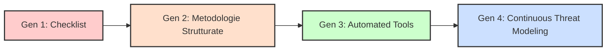
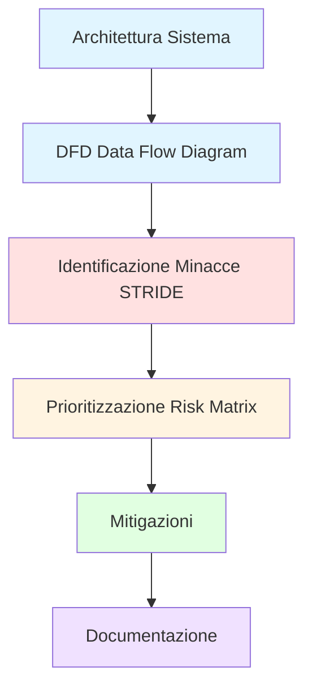
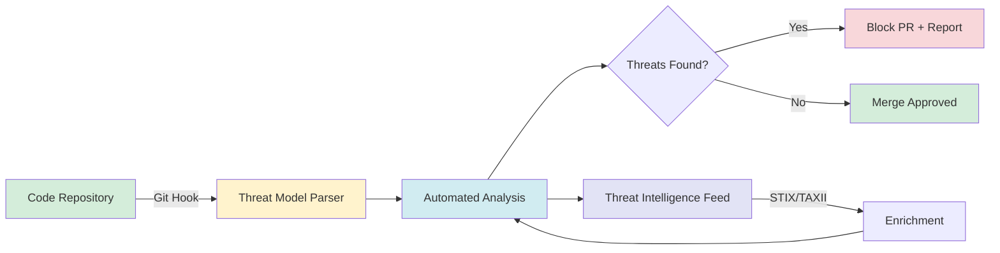
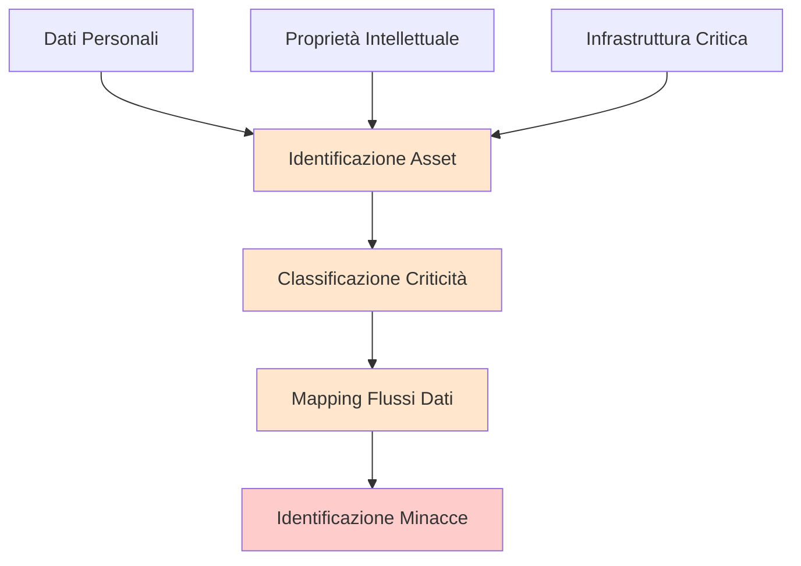
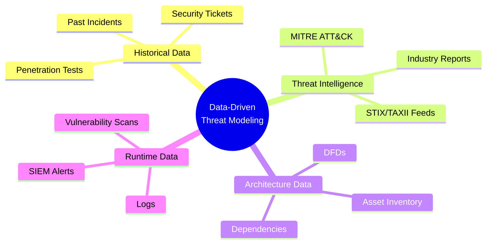
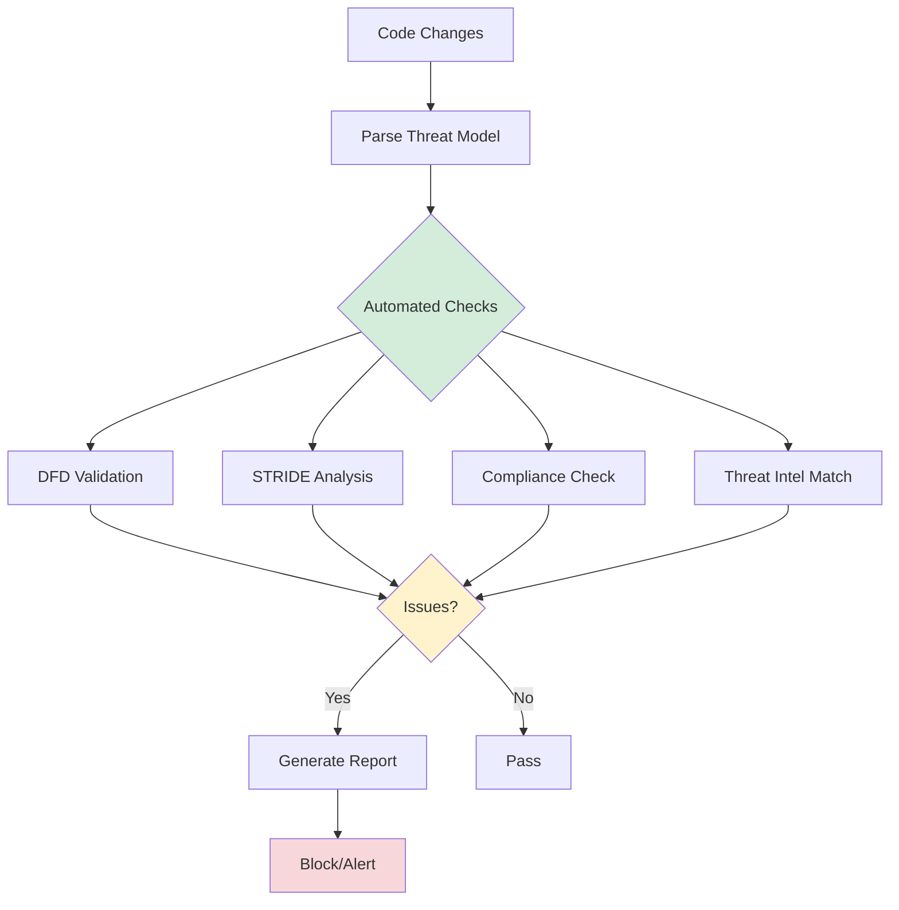
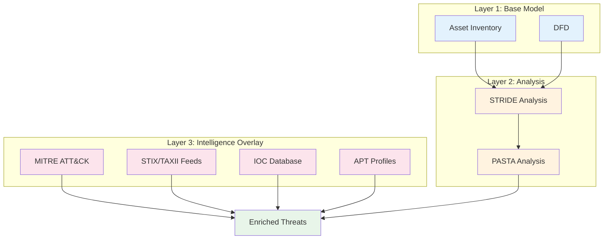
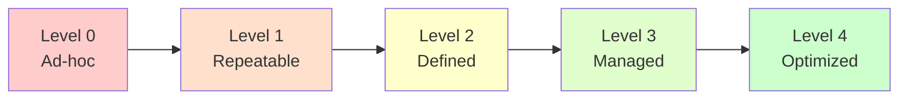
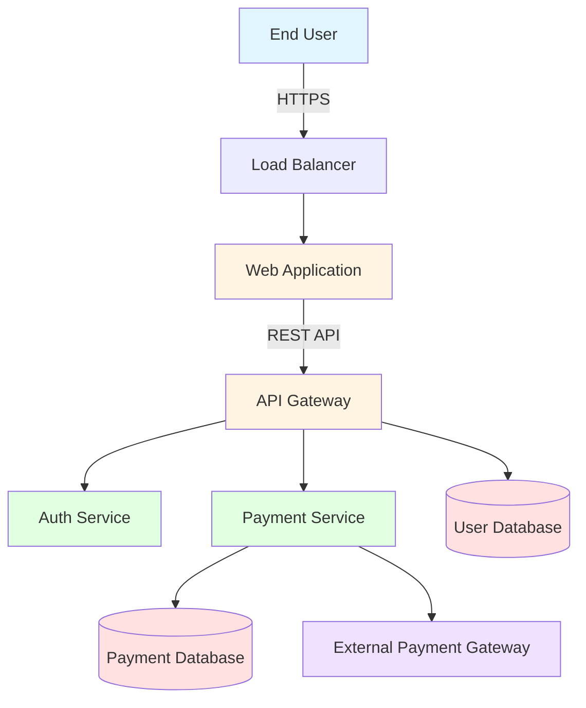
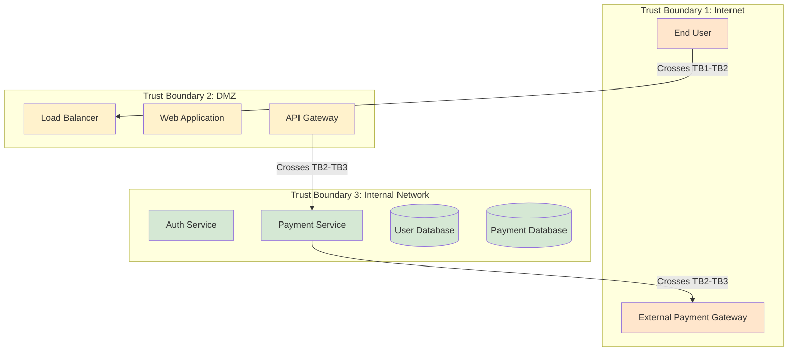

# Capitolo 1: Introduzione al Threat Modeling Moderno

## 1.1 Cos'è il Threat Modeling e Perché è Essenziale

Il **threat modeling** è un processo strutturato per identificare, quantificare e affrontare i rischi di sicurezza di un sistema informatico prima che vengano sfruttati da attaccanti reali.

### Definizione Formale

Il threat modeling risponde a quattro domande fondamentali:

1. **Cosa stiamo costruendo?** (Understanding the system)
2. **Cosa può andare storto?** (Identifying threats)
3. **Cosa facciamo al riguardo?** (Mitigating threats)
4. **Abbiamo fatto un buon lavoro?** (Validation)

### Perché è Essenziale

Considera questi dati reali:

- **Costo della remediation**: Correggere una vulnerabilità in produzione costa **100x** più che in fase di design (IBM Systems Sciences Institute)
- **Tempo di rilevamento**: Il tempo medio per identificare una breach è di **277 giorni** (IBM Security Report 2023)
- **Prevenzione**: Il 68% delle vulnerabilità potrebbe essere prevenuto con threat modeling adeguato (OWASP)

### Esempio Reale: Equifax Data Breach (2017)

**Scenario:**
- Vulnerabilità: Apache Struts CVE-2017-5638
- Dati esposti: 147 milioni di persone
- Costo: $1.4 miliardi
- Causa radice: Mancanza di threat modeling che avrebbe identificato:
  * Componente esterno non patchato
  * Dati sensibili non adeguatamente protetti
  * Mancanza di segmentazione di rete

**Lezione:** Un threat modeling avrebbe identificato Apache Struts come componente critico che processa dati sensibili, richiedendo:
- Monitoraggio attivo delle vulnerabilità
- Patch management prioritario
- Defense in depth

## 1.2 Evoluzione: Da Checklist a Processo Continuo

Il threat modeling si è evoluto attraverso quattro generazioni:



### Generazione 1: Checklist (2000-2010)

**Caratteristiche:**
- Liste di controllo statiche
- Approccio "one-size-fits-all"
- Eseguito una volta all'inizio del progetto
- Focus su compliance

**Esempio di Checklist:**

```markdown
## Security Checklist v1.0

- [ ] Input validation implementata
- [ ] Autenticazione presente
- [ ] Crittografia dati sensibili
- [ ] Logging abilitato
- [ ] Firewall configurato

Problemi:
✗ Non contestualizzato
✗ Non considera l'architettura specifica
✗ Falso senso di sicurezza
```

### Generazione 2: Metodologie Strutturate (2010-2015)

**Caratteristiche:**
- Framework come STRIDE, PASTA, LINDDUN
- Analisi basata su architettura
- Workshop dedicati
- Documentazione formale

**Evoluzione:**



### Generazione 3: Automated Tools (2015-2020)

**Caratteristiche:**
- Tool come Microsoft Threat Modeling Tool, OWASP Threat Dragon
- Generazione automatica di DFD
- Database di minacce predefinite
- Reportistica automatizzata

**Limiti:**
- Ancora processo "point-in-time"
- Difficile mantenere aggiornato
- Scarsa integrazione con CI/CD

### Generazione 4: Continuous Threat Modeling (2020-Oggi)

**Caratteristiche:**
- **Threat Modeling as Code**: Definizione in YAML/JSON
- **Integration CI/CD**: Analisi automatica ad ogni commit
- **Threat Intelligence**: Overlay con dati reali (STIX/TAXII)
- **Living Document**: Sempre aggiornato e versionato



**Vantaggi:**
- ✓ Sempre aggiornato
- ✓ Integrato nel workflow
- ✓ Scalabile
- ✓ Misurabile

## 1.3 I 4 Pilastri del Threat Modeling Moderno

Il threat modeling moderno si basa su quattro pilastri fondamentali che lo distinguono dagli approcci tradizionali.

### Pilastro 1: Asset-Centric Approach

**Concetto:** Inizia dagli asset da proteggere, non dalle vulnerabilità.



**Esempio Pratico:**

```yaml
# Asset Inventory
assets:
  - id: customer-pii
    name: Customer Personal Information
    type: data
    classification: confidential
    regulatory:
      - GDPR
      - CCPA
    criticality: critical
    
  - id: payment-data
    name: Payment Card Information
    type: data
    classification: restricted
    regulatory:
      - PCI-DSS
    criticality: critical
    
  - id: source-code
    name: Proprietary Source Code
    type: intellectual-property
    classification: internal
    criticality: high
```

**Perché funziona:**
- Focalizza le risorse sugli asset più critici
- Allinea sicurezza e business objectives
- Facilita compliance requirements

### Pilastro 2: Data-Driven Analysis

**Concetto:** Basa le decisioni su dati reali, non su ipotesi.

**Fonti di Dati:**



**Esempio di Analisi Data-Driven:**

```javascript
// Analisi basata su dati reali
const threatData = {
  historicalIncidents: [
    {
      type: 'SQL Injection',
      frequency: 'high',
      lastOccurrence: '2024-03-15',
      impact: 'critical'
    },
    {
      type: 'Authentication Bypass',
      frequency: 'medium',
      lastOccurrence: '2024-01-20',
      impact: 'high'
    }
  ],
  
  threatIntelligence: {
    activeCampaigns: 15,
    relevantTTPs: ['T1190', 'T1110', 'T1078'],
    iocMatches: 3
  },
  
  architectureRisks: {
    externalFacingComponents: 5,
    trustBoundaryCrossings: 12,
    unencryptedFlows: 2
  }
};

// Risk scoring basato su dati
function calculateRiskScore(threat) {
  return (
    threat.historicalFrequency * 0.3 +
    threat.threatIntelRelevance * 0.4 +
    threat.architectureExposure * 0.3
  );
}
```

### Pilastro 3: Automation & Tooling

**Concetto:** Automatizza il ripetibile, focalizza gli umani sul complesso.

**Cosa Automatizzare:**



**Tool Stack Moderno:**

```yaml
# Threat Modeling Toolchain
toolchain:
  parsing:
    - yaml-validator
    - zod-schema
    - custom-ast-parser
    
  analysis:
    - stride-analyzer
    - pasta-workflow
    - risk-calculator
    
  visualization:
    - mermaid-js
    - d3-js
    - graphviz
    
  integration:
    - github-actions
    - gitlab-ci
    - jenkins-plugin
    
  reporting:
    - markdown-templates
    - pdf-generator
    - dashboard-export
```

### Pilastro 4: Threat Intelligence Integration

**Concetto:** Arricchisci l'analisi con threat intelligence reale e aggiornata.

**Overlay Architecture:**



**Esempio di Enrichment:**

```javascript
// Da minaccia generica a threat intelligence-enriched
const baseThreat = {
  id: 'threat-001',
  type: 'Information Disclosure',
  component: 'payment-api',
  severity: 'high',
  description: 'Unencrypted data transmission'
};

// Dopo enrichment con STIX
const enrichedThreat = {
  ...baseThreat,
  
  mitreAttack: {
    tactics: ['TA0009: Collection'],
    techniques: [
      {
        id: 'T1041',
        name: 'Exfiltration Over C2 Channel',
        url: 'https://attack.mitre.org/techniques/T1041'
      }
    ]
  },
  
  threatActors: [
    {
      name: 'FIN7',
      motivation: 'Financial gain',
      sophistication: 'Advanced',
      targetSectors: ['Financial', 'Retail', 'Hospitality']
    }
  ],
  
  relatedMalware: [
    {
      name: 'Carbanak',
      type: 'Banking Trojan',
      iocs: [
        'hash:abc123...',
        'domain:malicious-c2.example.com'
      ]
    }
  ],
  
  recommendedActions: [
    'Implement TLS 1.3',
    'Deploy network segmentation',
    'Enable certificate pinning'
  ],
  
  riskScore: {
    base: 7.5,
    adjusted: 9.2, // Aumentato per threat actor activity
    factors: {
      activeExploitation: true,
      threatActorCapability: 'high',
      businessImpact: 'critical'
    }
  }
};
```

## 1.4 Diagramma: Maturità del Threat Modeling

Valuta la maturità del tuo programma di threat modeling usando questo framework:



### Livello 0: Ad-hoc

**Caratteristiche:**
- Nessun processo formale
- Reattivo agli incidenti
- Dipende da individui
- Nessuna documentazione

**Indicatori:**
- ✗ Threat modeling eseguito solo dopo breach
- ✗ Nessun template o metodologia
- ✗ Conoscenza tribale

### Livello 1: Repeatable

**Caratteristiche:**
- Processo base definito
- Eseguito per progetti critici
- Checklist standard
- Documentazione minima

**Indicatori:**
- ✓ Checklist di sicurezza
- ✓ Workshop occasionali
- ✓ Report base

### Livello 2: Defined

**Caratteristiche:**
- Metodologia standard (STRIDE/PASTA)
- Eseguito per tutti i progetti major
- DFD documentati
- Training del team

**Indicatori:**
- ✓ Template standardizzati
- ✓ DFD per ogni progetto
- ✓ Threat library
- ✓ Team trained

### Livello 3: Managed

**Caratteristiche:**
- Threat Modeling as Code
- Integrazione CI/CD
- Metriche e KPI
- Automation parziale

**Indicatori:**
- ✓ YAML/JSON threat models
- ✓ Automated analysis
- ✓ Metrics dashboard
- ✓ Version control

### Livello 4: Optimized

**Caratteristiche:**
- Continuous Threat Modeling
- Threat Intelligence integration
- ML/AI enhancement
- Proactive hunting

**Indicatori:**
- ✓ Real-time analysis
- ✓ STIX/TAXII feeds
- ✓ Predictive modeling
- ✓ Continuous improvement

### Self-Assessment Tool

```yaml
# Threat Modeling Maturity Assessment
assessment:
  questions:
    - id: q1
      question: "Quanto spesso esegui threat modeling?"
      options:
        - text: "Solo dopo incidenti"
          score: 0
        - text: "Per progetti critici"
          score: 1
        - text: "Per tutti i progetti major"
          score: 2
        - text: "Continuamente/automated"
          score: 3
          
    - id: q2
      question: "Che metodologia usi?"
      options:
        - text: "Nessuna"
          score: 0
        - text: "Checklist"
          score: 1
        - text: "STRIDE/PASTA"
          score: 2
        - text: "Custom + Automation"
          score: 3
          
    - id: q3
      question: "Come sono documentati i threat model?"
      options:
        - text: "Non documentati"
          score: 0
        - text: "Documenti Word/PDF"
          score: 1
        - text: "Template standard"
          score: 2
        - text: "YAML/JSON versionati"
          score: 3
          
    - id: q4
      question: "Integrazione con CI/CD?"
      options:
        - text: "Nessuna"
          score: 0
        - text: "Manuale"
          score: 1
        - text: "Parziale"
          score: 2
        - text: "Completa/automated"
          score: 3
          
    - id: q5
      question: "Usi threat intelligence?"
      options:
        - text: "No"
          score: 0
        - text: "Report occasionali"
          score: 1
        - text: "Feed base"
          score: 2
        - text: "STIX/TAXII integration"
          score: 3

  scoring:
    0-5: "Level 0: Ad-hoc - Inizia con training e checklist"
    6-10: "Level 1: Repeatable - Standardizza metodologia"
    11-15: "Level 2: Defined - Implementa automation"
    16-20: "Level 3: Managed - Aggiungi threat intelligence"
    21-25: "Level 4: Optimized - Continua a migliorare"
```

## 1.5 Esercizio: Analisi di un Caso Reale

### Scenario: Data Breach Prevention

**Contesto:**
Sei il security architect di una fintech startup che sta sviluppando una piattaforma di payment processing. Il team di sviluppo ha appena completato la prima versione dell'architettura.

**Architettura Proposta:**



**Dati Sensibili:**
- Informazioni personali utenti (nome, email, indirizzo)
- Dati di pagamento (card number, CVV, expiration date)
- Credenziali di accesso (hash password, MFA secrets)
- Transaction history

### Esercizio Guidato

**Step 1: Identificazione Asset (15 minuti)**

Completa la seguente tabella:

| Asset ID | Asset Name | Type | Classification | Criticality | Regulatory |
|----------|------------|------|----------------|-------------|------------|
| A001     |            |      |                |             |            |
| A002     |            |      |                |             |            |
| A003     |            |      |                |             |            |

**Step 2: Identificazione Trust Boundaries (10 minuti)**

Nell'architettura sopra, identifica i trust boundaries.

**Step 3: Analisi Minacce Base (20 minuti)**

Per ogni componente, identifica almeno 2 minacce STRIDE:

```yaml
# Template
Web Application:
  - Threat 1:
      type: 
      description: 
      severity: 
  - Threat 2:
      type: 
      description: 
      severity: 

Payment Service:
  - Threat 1:
      type: 
      description: 
      severity: 
  - Threat 2:
      type: 
      description: 
      severity: 
```

### Soluzione Commentata

**Step 1: Asset Inventory**

```yaml
assets:
  - id: A001
    name: User Personal Information
    type: data
    classification: confidential
    criticality: high
    regulatory:
      - GDPR
      - CCPA
    location: User Database
    
  - id: A002
    name: Payment Card Data
    type: data
    classification: restricted
    criticality: critical
    regulatory:
      - PCI-DSS
    location: Payment Database
    
  - id: A003
    name: Authentication Credentials
    type: data
    classification: restricted
    criticality: critical
    regulatory:
      - GDPR
    location: User Database
    
  - id: A004
    name: Payment Service
    type: application
    classification: internal
    criticality: critical
    regulatory:
      - PCI-DSS
    location: Internal Network
```

**Step 2: Trust Boundaries**



**Trust Boundaries Identificate:**

1. **TB1-TB2 (Internet → DMZ)**: Tutto il traffico esterno
   - Criticità: Alta
   - Controlli richiesti: WAF, TLS, Authentication

2. **TB2-TB3 (DMZ → Internal)**: Accesso ai servizi backend
   - Criticità: Critica
   - Controlli richiesti: Network segmentation, API gateway, mTLS

3. **TB3-External (Internal → External Payment)**: Comunicazione outbound
   - Criticità: Alta
   - Controlli richiesti: Certificate pinning, Encryption, Monitoring

**Step 3: STRIDE Analysis**

```yaml
Web Application:
  - Threat 1:
      type: Spoofing
      description: "Attaccante potrebbe impersonare utenti legittimi"
      severity: high
      mitigation: "Implement MFA, secure session management"
      
  - Threat 2:
      type: Information Disclosure
      description: "XSS potrebbe esporre dati utente nel browser"
      severity: high
      mitigation: "Input sanitization, CSP headers, output encoding"

Payment Service:
  - Threat 1:
      type: Tampering
      description: "Alterazione importi transazione in transito"
      severity: critical
      mitigation: "Digital signatures, TLS 1.3, integrity checks"
      
  - Threat 2:
      type: Information Disclosure
      description: "Esposizione dati card nel database"
      severity: critical
      mitigation: "Encryption at rest, tokenization, PCI-DSS controls"

API Gateway:
  - Threat 1:
      type: Denial of Service
      description: "DDoS attack per rendere il servizio indisponibile"
      severity: high
      mitigation: "Rate limiting, WAF, auto-scaling"
      
  - Threat 2:
      type: Elevation of Privilege
      description: "Bypass authorization per accedere ad altre API"
      severity: critical
      mitigation: "OAuth2 scopes, RBAC, API key validation"

User Database:
  - Threat 1:
      type: Information Disclosure
      description: "SQL injection per estrarre dati utenti"
      severity: critical
      mitigation: "Parameterized queries, ORM, input validation"
      
  - Threat 2:
      type: Tampering
      description: "Modifica non autorizzata dati utente"
      severity: high
      mitigation: "Audit logging, immutable records, access controls"
```

### Esercizio Autonomo

Ora applica quanto appreso a questo scenario:

**Scenario: Healthcare IoT Device**

Un dispositivo IoT medicale che monitora parametri vitali e li trasmette a un cloud service per analisi.

**Requisiti:**
1. Crea asset inventory (minimo 5 asset)
2. Disegna DFD con trust boundaries
3. Identifica 10 minacce STRIDE
4. Prioritizza le top 3 per criticalità
5. Proponi mitigazioni

**Template:**

```yaml
# Completa questo template
project: Healthcare IoT Device

assets:
  # Aggiungi qui

dfd:
  # Aggiungi qui

threats:
  # Aggiungi qui
  
risk_matrix:
  # Aggiungi qui
```

## Riepilogo Capitolo 1

### Concetti Chiave Appresi

1. **Threat Modeling è essenziale** per prevenire vulnerabilità prima che diventino incidenti
2. **Evoluzione** da checklist statiche a continuous threat modeling
3. **4 Pilastri** del threat modeling moderno:
   - Asset-centric approach
   - Data-driven analysis
   - Automation & tooling
   - Threat intelligence integration
4. **Maturity model** per valutare e migliorare il programma
5. **Approccio pratico** con esercizi guidati

### Prossimi Passi

Nel **Capitolo 2** esploreremo le principali metodologie (STRIDE, PASTA, LINDDUN) e impareremo a scegliere quella giusta per ogni scenario.

### Risorse Aggiuntive

- **OWASP Threat Modeling Cheat Sheet**: https://cheatsheetseries.owasp.org/cheatsheets/Threat_Modeling_Cheat_Sheet.html
- **Microsoft Threat Modeling Tool**: https://docs.microsoft.com/en-us/azure/security/develop/threat-modeling-tool
- **NIST SP 800-154**: Guide to Data-Centric System Threat Modeling

### Checklist di Verifica

Prima di procedere al Capitolo 2, assicurati di:

- [ ] Aver compreso i 4 pilastri del threat modeling moderno
- [ ] Aver completato l'esercizio guidato
- [ ] Aver tentato l'esercizio autonomo
- [ ] Aver valutato la maturità del tuo attuale approccio
- [ ] Aver identificato almeno 3 miglioramenti applicabili al tuo contesto

---

**Fine Capitolo 1**